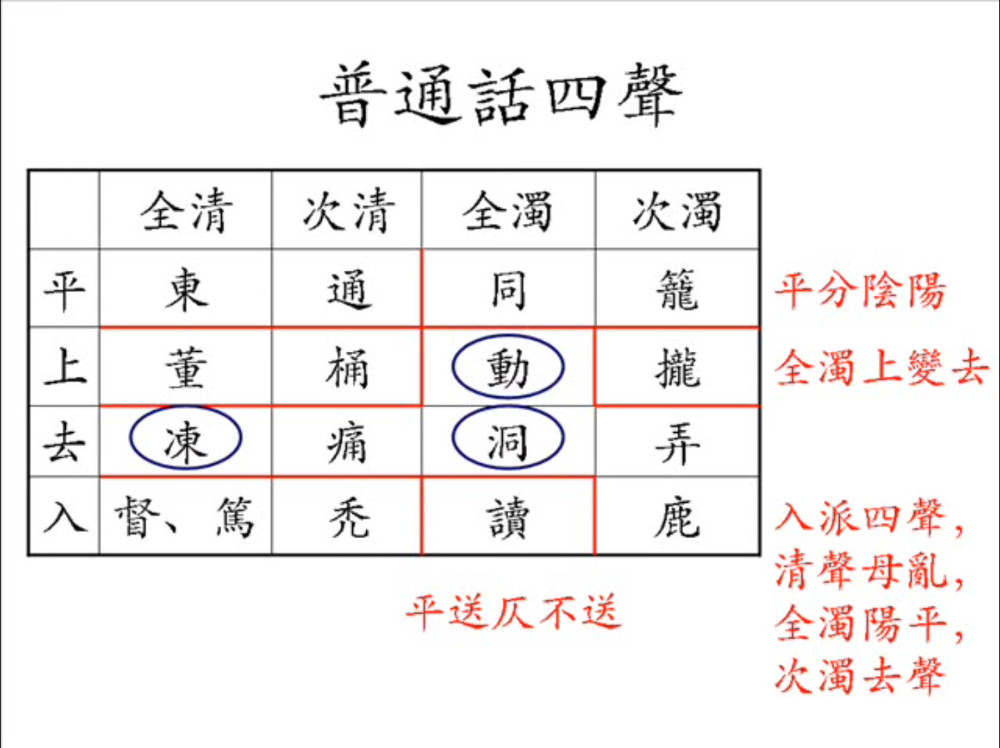
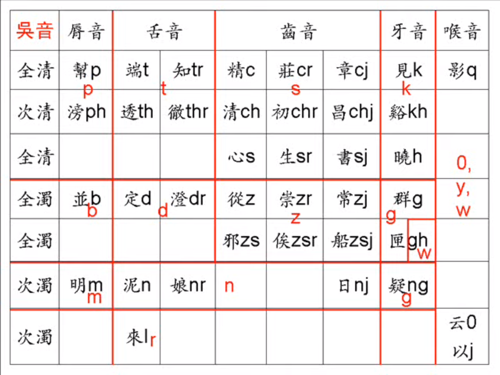
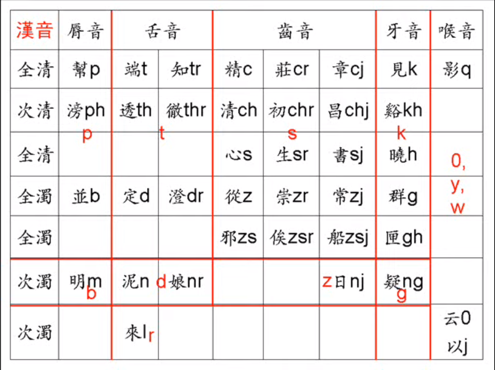
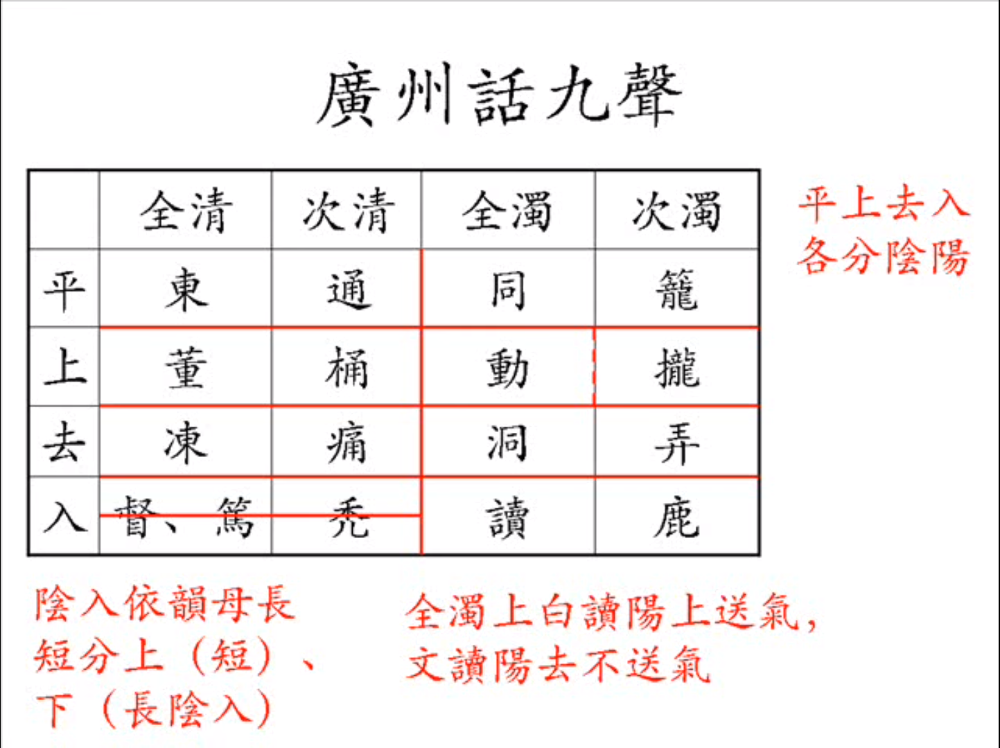

MiddleChinesePhonology | 中古汉语语音 trung koq hanh ngyoq ngyoq qyim

CLC: H11

Linguists sometimes refer to the system of the Qieyun （切韵） as **Early Middle Chinese** and the variant revealed by the rime tables （韵图） as **Late Middle Chinese**.

**⚠️注意：由于学习顺序，部分内容直接使用了 polyhedron 前辈的古韵罗马字，其他内容亦可能包含过时观点。正在补课，当前倾向于「切韵拼音」及与此拼音相接近的拟音**

- [polyhedron 本人对古韵罗马字及切韵拼音的评价 - 知乎](https://www.zhihu.com/question/372828311/answer/2441585425)

> 被視爲《廣韻》中最複雜的現象的「重紐」問題至今仍是研究的熱點，目前各家研究的成果分歧很大，還在爭論當中。不過隨着研究的深入，僅僅通過考古是難再更上一層樓了。更深入的研究需要通過構擬上古漢語，並依此下推出中古漢語重紐的來源。這方面的研究被稱爲「古音學」（研究周秦古音），與研究《切韻》中古音系的「今音學」不同，上古音系的構擬還很不成熟，有待於漢藏語系之間的語言橫向比較和歷史比較語言學的進一步發展。

参考链接

- [切韵拼音 - 绯索卡 · Phesoca](https://phesoca.com/tupa/)
    - 新活旧整：切韵拼音16摄图//开倒车（ https://zhuanlan.zhihu.com/p/483856847?utm_psn=1717859410859380736
- [韵典网](https://ytenx.org/)
- [廣韻中的重紐與重紐歸類問題 - BYVoid](https://byvoid.com/zht/blog/kuangx-yonh-dryung-nriux/)
    - > 總結一下重紐的定義，重紐現象就是「在脣牙喉音，支脂祭眞仙宵侵鹽，八個韻系下的小韻中，通過反切系聯歸一類，卻列爲兩個不同的小韻的現象」，這種現象在韻圖上面的反映就是兩個小韻分別列在了同一聲韻的三等和四等位置上。
- poem: 广韵字音表（20170209，poem版）
- app 「汉字古今中外读音查询」
- app 「韵典」
- [切韵音- Knowpia百科](https://www.knowpia.cn/pages/%E5%88%87%E9%9F%B5%E9%9F%B3)
- [摄_(声韵学)- Knowpia百科](https://www.knowpia.cn/pages/%E6%94%9D_(%E8%81%B2%E9%9F%BB%E5%AD%B8))
- [等呼- Knowpia百科](https://www.knowpia.cn/pages/%E7%AD%89%E5%91%BC)
- [广韵校本上.pdf - mdict](https://mdx.mdict.org/%E4%B8%AD%E5%8D%8E%E6%96%87%E5%8C%96%E5%B7%A5%E5%85%B7%E4%B9%A6/%E5%8F%A4%E9%9F%B3%E9%9F%B5%E8%AF%AD%E6%B3%95%E7%AD%89/%E5%B9%BF%E9%9F%B5%E6%A0%A1%E6%9C%AC%20%E4%B8%8A.pdf)
- [广韵校本下册.pdf - mdict](https://mdx.mdict.org/%E4%B8%AD%E5%8D%8E%E6%96%87%E5%8C%96%E5%B7%A5%E5%85%B7%E4%B9%A6/%E5%8F%A4%E9%9F%B3%E9%9F%B5%E8%AF%AD%E6%B3%95%E7%AD%89/%E5%B9%BF%E9%9F%B5%E6%A0%A1%E6%9C%AC%E4%B8%8B%E5%86%8C.pdf)
- [泽存堂本广韵・《宋本广韵》（中国书店1982年据张氏泽存堂本影印）.pdf](https://downloads.freemdict.com/%E5%B0%9A%E6%9C%AA%E6%95%B4%E7%90%86/%E9%9B%86%E5%90%88/%E6%96%87%E5%AD%97%E8%AF%8D%E5%85%B8/%E5%AD%97%EF%BC%8C%E8%AF%8D%EF%BC%8C%E5%8F%A5%EF%BC%8C%E7%AF%87%E5%B7%A5%E5%85%B7%E4%B9%A6/1%E3%80%81%E5%AD%97/%E3%80%8A%E5%AE%8B%E6%9C%AC%E5%B9%BF%E9%9F%B5%E3%80%8B%EF%BC%88%E4%B8%AD%E5%9B%BD%E4%B9%A6%E5%BA%971982%E5%B9%B4%E6%8D%AE%E5%BC%A0%E6%B0%8F%E6%B3%BD%E5%AD%98%E5%A0%82%E6%9C%AC%E5%BD%B1%E5%8D%B0%EF%BC%89.pdf)
- [AWs-309 切韵拟音J - 绯索卡 · Phesoca](https://phesoca.com/aws/309/)
- [切韵拟音 L 预览（UntPhesoca的想法 - 知乎）](https://www.zhihu.com/pin/1547712591362981888)
- [【汉语音韵学笔记】束娄东切韵拟音V8 - msoeg的文章 - 知乎](https://zhuanlan.zhihu.com/p/145409852)
- [中古擬音 - 雪齋的文章 - 知乎 （看评论区讨论）](https://zhuanlan.zhihu.com/p/560047021)
- [切韵拟音L、切韵通俗拟音 - 绯索卡 · Phesoca](https://phesoca.com/aws/337/)
- 赵元任的《通字方案》 https://zh.wikipedia.org/zh-hans/%E9%80%9A%E5%AD%97%E6%96%B9%E6%A1%88
    - 施氏食狮史 shi zhii zhic sri srii
    - 基于中古汉语做简化，以求方便地兼顾现代众方言，包括利用吴语的声母、官话的介音和韵腹、粤语的韵尾。。。真是很多音韵爱好者都会做的事吧
    - https://github.com/lotem/zime/blob/master/zime-data/tungdzih/tungdzih-keywords.txt
    - https://github.com/baopaau/rime-tungdzih
    - 有空做个推导方案？如果他严格基于中古汉语的话
        - 这里已经给出每个小韵对应的通字了，基于改之即可！ https://github.com/baopaau/rime-tungdzih/blob/master/tungdzih-siaoyunn.txt
        - 要是有个自动从小韵生成推导方案的程序就好了——不过推导思路总会有不一样的。
- 发现个有意思的人 Tangent Constructed Chinese https://tcchinese.tumblr.com/ 2014年就开始发东西了
- （弃用）[用户:Polyhedron/中古汉语拼音](https://zh.wikipedia.org/wiki/User:Polyhedron/%E4%B8%AD%E5%8F%A4%E6%BC%A2%E8%AA%9E%E6%8B%BC%E9%9F%B3)
- （弃用）[unt 切韵朗读音：早期中古汉语的一种可读实现](https://zhuanlan.zhihu.com/p/58227457)
    - [unt个人博客此文链接](https://phesoca.com/aws/281/)

字音的构造：（韵典网）

- 声母 + 介音 + 韵腹 + 韵尾 + 声调
    - 声母：五音、清浊、三十六字母
    - 介音：等呼、开合口
    - 韵腹：十六摄、内外转
    - 韵尾：阴声韵（无韵尾，半元音iud）、阳声韵（鼻音）、入声韵（塞音）
    - 声调：四声八调、平仄、舒促
- 【待学】确定声韵，需要声和韵，其中韵部不仅定以摄、等、开合、声调，还定于细微（重纽……）
- `小韵` 则是声母韵母都相同的字，《广韵》26194字共有小韵3874个。
    - 查询到其中同音字最多，即包含字数最多的小韵是「靈（廣韻第九百三十九小韻）（leng）」，87个，同音字如下：*靈霛𩆈𩆜舲齡麢𦏰囹鴒䉁蛉鈴霝醽苓櫺柃𩆚伶泠瓴𧕅拎刢𧆺𤣘𤫲玲𦉢𩖊㾉聆竛𠄖蘦軨䡼笭零孁令𪕌灵𩟃𩵀龗翎閝鹷䴇昤駖𧖜𩆮蕶酃詅彾䯍呤跉狑𤣤爧冷怜𠱠𦫊𢺰澪鏻𥤞秢䕘獜岭魿𣬹𩚹紷䉹砱阾羚姈㸳*
        - 大部分都不常用啊……在字音表里注明广州话普通话读音的也就这么12个：靈齡囹鈴苓伶泠玲聆零翎羚。四舍五入就是使用中古音的话非生僻字里同音字最多就12个的水平。完美。
        - 包含字数第二多的小韵是嗁de，60个；再往后，禄luk47，同dung45，逾jyo45，猷ju45，雳lek45，刘liu44，𧚍giu44，第十位は聊leu42，第十一位は唐dang40，第十二位は煩byan38

# 声母 sjiaeng mouq

## 声母表

改编参考 https://wenku.baidu.com/view/404793e5af45b307e87197f1.html   https://www.knowpia.cn/pages/%E5%88%87%E9%9F%B5%E9%9F%B3 

38个声母使用。不同于唐末宋代「三十六字母」。

<table border="0">  <tr>
  <td> </td> <td> </td> 
  <td>全清</td><td>次清</td><td>全浊</td><td>次浊</td> 
  <td>全清</td><td>全浊</td>
</tr>   <tr>
  <td            >唇音</td> <td>帮组</td> 
  <td>幫（pang）p */p/</td><td>滂（phang）ph */pʰ/</td><td>並（bengq）b */b/</td><td>明（myaeng）m */m/</td> 
  <td>   </td><td>   </td>
</tr>   <tr>
  <td rowspan="3">舌音</td> <td>（舌头音）端组</td> 
  <td>端（twan）t */t/</td><td>透（thouh）th */tʰ/</td><td>定（dengh）d */d/</td><td>泥（nej）n */n/</td> 
  <td>   </td><td>   </td>
</tr>    <tr>
                            <td>（舌上音）知组</td> 
  <td>知（trie）tr */ʈ/</td><td>徹（trhiet）thr */ʈʰ/</td><td>澄（draeng）dr */ɖ/</td><td>娘（nryang）nr */ɳ/</td> 
  <td>   </td><td>   </td>
</tr>    <tr>
                            <td>（半舌音）    </td> 
  <td>    </td><td>     </td><td>    </td><td>來（leoj）l */l/</td> 
  <td>   </td><td>   </td>
</tr>    <tr>
  <td rowspan="3">齿音</td> <td>精组（齿头音）</td> 
  <td>精（tsiaeng）ts */ts/</td><td>清（tshiaeng）tsh */tsʰ/</td><td>從（dzuong）dz */dz/</td><td>  </td> 
  <td>心（sim）s */s/</td><td>邪（ziae）z */z/</td>
</tr>    <tr>
                            <td>莊组（正齿音庄组）</td> 
  <td>莊（tsryang）tsr */tʂ/</td><td>初（tsrhyo）tsrh */tʂʰ/</td><td>崇（dzrung）dzr */dʐ/</td><td>  </td> 
  <td>生（sryaeng）sr */ʂ/</td><td>俟（zryq）zr */ʐ/</td>
</tr>      <tr>
                            <td>章组（正齿音章组。日母为半齿音）</td> 
  <td>章（tjyang）tj */tɕ/</td><td>昌（tjhyang）tjh */tɕʰ/</td><td>常（djyang）dj */dʑ/</td><td>日（njit）nj */ȵ/</td> 
  <td>書（sjyo）sj */ɕ/</td><td>船（zjwien）zj */ʑ/</td>
</tr>    <tr>
  <td            >牙音</td> <td>見组</td> 
  <td>見（kenh）k */k/</td><td>溪（khej）kh */kʰ/</td><td>羣（gun）g */g/</td><td>疑（ngy）ng */ŋ/</td> 
  <td>   </td><td>   </td>
</tr>        <tr>
  <td rowspan="2">喉音</td> <td>    </td> 
  <td>影（qyaengq）q */ʔ/</td><td>    </td><td>   </td><td>   </td> 
  <td>曉（hewq）h */x/</td><td>匣（ghaep）gh */ʁ/</td>
</tr>      <tr>
                            <td>    </td> 
  <td>   </td><td>   </td><td>   </td><td>云（un）（不标） */ɦ或无/，以（jyq）j */j/</td> 
  <td>   </td><td>   </td>
</tr>
</table>

## 声母可搭配的等呼

中古汉语除了韵母分为不同等呼外，声母也有等呼属性，决定了声母只能和某些特定等呼的韵母相拼。这一定程度上反映了声母在上古汉语中的历史痕迹。

详表参见「等呼- Knowpia百科」。

分组讨论一些规律：

- 帮滂并明：只拼开口
- 端透定泥：只拼一四
- 来母：只拼一等、三乙、四等
- 知澈澄娘：只拼二等、三甲
- 精清从心：只拼一等、三乙、四等
- 邪：只拼三乙
- 章昌常书船日：只拼三乙
- 庄初床山：只拼二等、三甲
- 俟母：只拼之韵（三C）
- 见溪疑影晓：啥都拼
- 群母：只拼三等
- 匣母：只拼一二四
- 云母：只拼三甲
- 以母：只拼三乙

互补观察：

- 知澈澄娘（卷舌） 同搭配于 庄初床山（zhchsh）
- （古无舌上）：端透定泥（齿龈） & 知澈澄娘（卷舌）
- （古无正齿）：（照二）庄初床山（zhchsh） & （照三）章昌常书船（jqx）
    - 照二归精：庄组古精组
    - 照三归端：章组古端组
- 古无舌上+照三归端：端透定泥（齿龈） &  知澈澄娘/庄初床山  & 章昌常书船日（jqx）
- 照二归精：庄初床山/知澈澄娘 & 精清从心（zcs）
- 匣母（/gh/） & 群母（/g/）
- 匣母（/gh/） & 云母（/ɦ/） & 以母（/j/）
- 匣母只拼非三等，所以擬成小舌音 ʁ 很恰當咯

原理：

- 端组、知组、章组上古同来源
    - 所以切韵拼音 t tr tj
- > 切韵时代庄组几乎仍然是精组的条件变体（[知乎](https://zhuanlan.zhihu.com/p/478751152)）

## 尖团音

精组（精清从心邪）齐撮、见系（见溪群晓匣）齐撮，声母相异，分尖团也。例如典型的河南中原官话，精组齐撮为（拼音）z、c、s，见系齐撮为（拼音）j、q、x。

> 南方方言不太适用尖团概念的原因是，个别南方方言在尖团音这些字的情况里，往往可能丢失【-i-】介音，比如闽南语和粤语，所以一定意义上说，尖团音是对完整地在见组和精组保留并发展了的中古汉语二三四等介音的汉语方言的一个概念，南方方言对中古汉语的介音（不论辅音性还是元音性）有着大面积的丢失，所以不太适用。
> （总结：只适用于保留中古汉语二三四等介音者，一些南方方言丢失这些介音，故不适用讨论尖团。）
> （https://www.zhihu.com/question/28726862）


## 一些声母的讨论

### 俟母

[俟母怎么来的？ - 知乎](https://www.zhihu.com/question/338035956)

- > 怎么解释俟母的来源？为什么俟母只有之韵字？
- 评论区 Sliark 大佬说：
- > 或许有些“俟母”已经混入崇母了，比如「事」~「吏」。
- > 俟母就大概来自某种特殊的r吧……

### 影母系咪零声母

- [中古汉语中影母是零声母更合适还是[ʔ]更合适？以母与云母是近音更合适还是擦音更合适？ - 知乎](https://www.zhihu.com/question/525942883)
- [影母 - 维基 - 粤语](https://zh-yue.wikipedia.org/wiki/%E5%BD%B1%E6%AF%8D)
- [影母 - 维基](https://zh.wikipedia.org/wiki/%E5%BD%B1%E6%AF%8D)

一般说是或许是 ʔ。但类似于普通话的零声母？因为普通话的 tian-an-men 也不能连读（当然一部分原因是鼻音韵尾不发完）

# 韵母 unh mouq

## 韵目用字及其韵母整理

一个韵目可能有多种等、呼、重纽的形式。整理以熟悉韵目用字

在此保留「摄」，知法犯法🤪毕竟也是常用术语，一并熟悉

舉平以賅上去入

韻目 unh muk

| 韻目 unh muk / 攝 sjiep | 切拼 | 備註 | 普 | 廣 | 滬
-|-|-|-|-|-
_果攝_ | kwaq | | guo3 | gwo2(gu2) | ku5
歌一 (w)a 歌三 ya/ua | ka | 一合三開三合又叫戈韻 | ge1 | go1 | ku1
（戈） | kwa | 歌韻的一部分的又名 | ge1 | gwo1 | ku1
_假攝_ | kaeq | | jia3 | gaa2 | cia5, _ka5_
麻二 (w)ae 麻三 iae | mae |  | ma2 | maa4 | mo6 
_遇攝_ | nguoh | | yu4 | jyu6 | yu6
模 o | mo | 一 | mo2, mu2 | mou4 | mu6, mo6
魚 yo | ngyo | 三C | yu2 | jyu4 | yu6, _ng6_
虞 uo | nguo | 三C | yu2 | jyu4 | yu6, niu6
_蟹攝_ | gheeq | | xie4 | haai5 | ha5
_止攝_ | tjyq | | zhi3 | zi2 | tsy5
_效攝_ | ghaewh | | xiao4 | haau6 | 
_流攝_ | lu | | liu2 | lau4 | lieu6
_咸攝_ | gheem | | xian2 | haam4 | ghe6
_深攝_ | sjim | | shen1 | sam1 | sen1
_山攝_ | sreen | | shan1 | saan1 | se1
_臻攝_ | tsryin | | zhen1 | zeon1 | tsen1
_曾攝_ | tseong | | zeng1 | zang1 | tsen1
_梗攝_ | kaengq | | geng3 | gang2(gwaang2) | kan5
_宕攝_ | dangh | | dang4 | dong6 | daon6
_江攝_ | koeung | | jiang1 | gong1 | cian1, _kaon1_
_通攝_ | thoung | | tong1 | tung1 | thon1

## 以前从维基复制来的科普，留作批判

> 摄，又称韵摄，是唐字声韵学上，将韵的归类方式，尤其指中古音《广韵》十六摄。凡声韵学讲的摄，通常即为十六摄之一。
> 
> 摄，即统摄之意，原自于佛教，将近韵归纳。摄归法是只看韵腹及韵尾，而不理四声、开合、韵头等等，将近韵归入同一摄下面。
> 
> 等呼的概念基本用于描述中古汉语的介音系统，最先应用在韵图上。韵图把韵书中相类似的韵目归为一大类，称为摄，每一摄内部，又主要根据介音的差异，分为四等，每等又分为开口和合口两呼，一共是八个小类。现代语言学家对于呼的观点比较一致，开口呼和合口呼，就是指有无u介音而言，同一摄同一等的合口呼比开口呼多了介音u。
> 
> 相比之下，等的概念就比较复杂，普遍的观点是三等韵有类似i的介音，因为三等字所用的反切上字自成一套，与一二四等不同。例如歌韵在韵图上被分为一等和三等，三等就比一等多了介音i。但有些摄包括的韵很多，如山摄，包括了寒、桓、删、山、元、仙、先等韵，其中寒桓是一等，删山是二等，元是三等，先是四等，仙分为三四等。除了同意三等韵有i介音外，有些学者（如高本汉、王力）认为四等韵也有介音，有些学者（如潘悟云、郑张尚芳）认为二等韵也有介音。但所有学者都同意，即使部分以介音相区别，这些韵的主元音不会全部相等。清江永说：“一等洪大，二等次大，三四皆细，而四尤细。”可作为分等原则的粗略概括。（但是如前所见，有同一韵分为三四等，也有四等比三等洪大的）
> 
> 《韵图》成书于公元十二世纪。此书首次提出等。此时是中古汉语的后期。潘悟云给此时的汉语拟音，认为当时的音韵学家分等的原则是依据紧接声母的元音：四等是[e]，三等是[i]，二等是[​ɯ]，一等是其他元音。这里说的“紧接声母的元音”可以是韵腹，如ba的a，也可以是韵首，如biao的i。
> 
> 现在学界普遍认为，三等字在上古汉语中带介音[j]/[i]，二等字在上古汉语中带介音[r]，一等字和四等字在上古汉语中无介音。
>
> -- （摘自维基百科）

`摄`是一种宽松的归类，标准是韵尾和（粗分）韵腹。摄内再分韵部的依据是`等呼`，即介音和细分韵腹，标准是介音以及韵头。容易理解，对押韵最重要的是后部，因此宽分类（摄）按后部，而细分类（韵部）继续按靠前一些的部位来分。声母不参与押韵，故与韵母分开讨论，但在二者相接的位置会有相互作用，尤其是代表前部的等呼。

## 等

根据 [AWs-309 切韵拟音J - 绯索卡 · Phesoca](https://phesoca.com/aws/309/)，《切韵》音系音节分类的首要特征就是三等–非三等。

三等A类即重纽四等，三等B类即重纽三等。 [重纽 - 维基](https://zh.wikipedia.org/wiki/%E9%87%8D%E7%B4%90)

[切韵小统计：三等非三等混切（及声母的拆分） - UntPhesoca的文章 - 知乎](https://zhuanlan.zhihu.com/p/541263851)

> 早期中古汉语的音节可以这样分类：

- 三等
    - 钝音声母[1]三等 A 类（前元音三等，重纽 A 类）
    - 钝音声母三等 B 类（前元音三等，重纽 B 类[2]）
    - 钝音声母三等 C 类（非前元音三等）
    - 锐音声母三等（锐音声母无重纽）
- 非三等
    - 一等
    - 二等
    - 四等

二等来自上古汉语的 r 介音，在中古汉语里大概表现为咽化元音。（复杂问题）

## 独韵与开合韵

并不是所有韵母都有开口与合口的对立，在《切韵指掌图》里，不分开合口的韵，标明为独韵；既有开口又有合口的韵，标明为开合韵。后来的韵书把独韵分别归入开口或合口，例如把东韵归入合口，侵韵归入开口。李荣《切韵音系》认为，独韵没有u介音；后来归入合口的独韵，是因为有圆唇的主元音。他又认为开合韵的唇音字和独韵一样没有开合口的对立，可以和开口字互切，也可以和合口字互切，唇音字可以认为是开口。

## 韵母表

[韻母及反切下字一览 - 韵典](https://ytenx.org/kyonh/yonh)

注：很多韵有开合口两种，只列开口

通摄（东ung、冬uung）、江摄（江rung）、止摄（支ie、脂ii、之i、微ioi）、遇摄（鱼io、模o虞yo）、蟹摄（齐e、泰ad夬rad祭ied、佳re、灰uai、咍ai皆rai废iad）、臻摄（痕on真in、谆yn、臻in、文yon、欣ion、魂uon）、山摄（元ian、桓uan、删ran、寒an山ren仙ien先en）、效摄（豪au肴rau宵ieu萧eu）、果摄（歌a、戈ia）、假摄（麻ra）、宕摄（唐ang阳iang）、梗摄（耕reng、庚rang清ieng青eng、庚三ieng）、曾摄（登ong蒸ing、职yk）、流摄（尤iu侯u、幽y）、深摄（侵im）、咸摄（覃om咸rem盐iem添em、谈am衔ram严iam、凡yam）

广韵 206 韵

平|上|去|入
-|-|-|-
上平一东	  |上声一董	    |去声一送	|入声一屋
上平二冬	  |	            |去声二宋	|入声二沃
上平三锺	  |上声二肿	    |去声三用	|入声三烛
上平四江	  |上声三讲	    |去声四绛	|入声四觉
上平五支	  |上声四纸	    |去声五寘	
上平六脂	  |上声五旨	    |去声六至	
上平七之	  |上声六止	    |去声七志	
上平八微	  |上声七尾	    |去声八未	
上平九鱼	  |上声八语	    |去声九御	
上平十虞	  |上声九麌	    |去声十遇	
上平十一模  |上声十姥	    |去声十一暮	
上平十二齐  |上声十一荠   |去声十二霁	
$\space$    |            |去声十三祭  |	
$\space$    |            |去声十四泰  |	
上平十三佳  |上声十二蟹	  |去声十五卦	
上平十四皆  |上声十三骇	  |去声十六怪	
$\space$    |            |去声十七夬  |
上平十五灰  |上声十四贿	  |去声十八队	
上平十六咍  |上声十五海	  |去声十九代	
$\space$    |            |去声二十废  |	
上平十七真  |上声十六轸	  |去声二十一震	|入声五质
上平十八谆  |上声十七准	  |去声二十二稕	|入声六术
上平十九臻  |	            |		        |入声七栉
上平二十文  |上声十八吻	  |去声二十三问	|入声八物
上平二十一欣|上声十九隐	  |去声二十四焮	|入声九迄
上平二十二元|上声二十阮	  |去声二十五愿	|入声十月
上平二十三魂|上声二十一混	|去声二十六慁	|入声十一没
上平二十四痕|上声二十二很	|去声二十七恨	
上平二十五寒|上声二十三旱	|去声二十八翰	|入声十二曷
上平二十六桓|上声二十四缓	|去声二十九换	|入声十三末
上平二十七删|上声二十五潸	|去声三十谏	  |入声十五鎋
上平二十八山|上声二十六产	|去声三十一裥	|入声十四黠
下平一先	  |上声二十七铣	|去声三十二霰	|入声十六屑
下平二仙	  |上声二十八狝	|去声三十三线	|入声十七薛
下平三萧	  |上声二十九篠	|去声三十四啸	
下平四宵	  |上声三十小 	|去声三十五笑	
下平五肴	  |上声三十一巧	|去声三十六效	
下平六豪	  |上声三十二晧	|去声三十七号	
下平七歌	  |上声三十三哿	|去声三十八个	
下平八戈	  |上声三十四果	|去声三十九过	
下平九麻	  |上声三十五马	|去声四十祃	
下平十阳	  |上声三十六养	|去声四十一漾	|入声十八药
下平十一唐  |上声三十七荡	|去声四十二宕	|入声十九铎
下平十二庚  |上声三十八梗	|去声四十三映	|入声二十陌
下平十三耕  |上声三十九耿	|去声四十四诤	|入声二十一麦
下平十四清  |上声四十静	  |去声四十五劲	|入声二十二昔
下平十五青  |上声四十一迥	|去声四十六径	|入声二十三锡
下平十六蒸  |上声四十二拯	|去声四十七证	|入声二十四职
下平十七登  |上声四十三等	|去声四十八嶝	|入声二十五德
下平十八尤  |上声四十四有	|去声四十九宥	
下平十九侯  |上声四十五厚	|去声五十候	
下平二十幽  |上声四十六黝	|去声五十一幼	
下平二十一侵|上声四十七寝	|去声五十二沁	|入声二十六缉
下平二十二覃|上声四十八感	|去声五十三勘	|入声二十七合
下平二十三谈|上声四十九敢	|去声五十四阚	|入声二十八盍
下平二十四盐|上声五十琰	  |去声五十五艳	|入声二十九叶
下平二十五添|上声五十一忝	|去声五十六㮇	|入声三十怗
下平二十六咸|上声五十三豏	|去声五十八陷	|入声三十一洽
下平二十七衔|上声五十四槛	|去声五十九鉴	|入声三十二狎
下平二十八严|上声五十二俨	|去声五十七酽	|入声三十三业
下平二十九凡|上声五十五范	|去声六十梵	  |入声三十四乏

polyhedron 中古汉语拼音版（举平声以赅上去）

\\ |一等|二等|三等|四等
-|-|-|-|-
**果摄**|
开口|歌 a| |戈 ia	
合口|戈 ua|	|戈 ya
**假摄**|
开口|  |麻 ra|麻 ia	
合口|  |麻 rua
**遇摄**|
开合|模 o| |鱼 io <br> 虞 yo
**蟹摄**|
开口|咍 ai|佳 re <br> 皆 rai| |齐 e
合口|灰 uai|佳 rue <br> 皆 ruai| |齐 ue
开口|泰 ad|夬 rad|祭 *ied <br> 废 iad	
合口|泰 uad|夬 ruad|祭 *yed <br> 废 yad
**止摄**|
开口| | |支 *ie <br> 脂 *ii <br> 之 i <br> 微 ioi	
合口| | |支 *ye <br> 脂 *yi <br> 微 yoi
**效摄**|
开合|豪 au|肴 rau|宵 *ieu|萧 eu
**流摄**|
开合|侯 u| |尤 iu <br> 幽 y	
**咸摄**|
开口|谈 am|衔 ram <br> 咸 rem|盐 *iem <br> 严 iam|添 em
合口| | |凡 yam	
开口|覃 om
**深摄**|
开口| | |侵 *im
**山摄**|
开口|寒 an|删 ran <br> 山 ren|仙 *ien <br> 元 ian|先 en
合口|桓 uan|删 ruan <br> 山 ruen|仙 *yen <br> 元 yan|先 uen
**臻摄**|
开口|痕 on| |真臻 *in <br> 欣 ion	
合口|魂 uon| |真谆 *yn <br> 文 yon
**宕摄**|
开口|唐 ang| |阳 iang	
合口|唐 uang| |阳 yang
**梗摄**|
开口| |庚 rang <br> 耕 reng	|庚清 *ieng	|青 eng
合口| |庚 ruang <br> 耕 rueng	|庚清 *yeng	|青 ueng
**曾摄**|
开口|登 ong| |蒸 ing	
合口|登 uong| |职 yk
**通摄**|
开合|东 ung| |锺 yung	
开合|冬 uung| |东 iung
**江摄**|
开合| |江 rung


### 摄的小归纳

- 无韵尾：果摄、假摄、遇摄
    - 果摄ɑ，一三
    - 假摄a，二三
    - 遇摄o，一三
- 韵尾或整体i：蟹摄、止摄
    - 蟹摄ai、e
    - 止摄i，三等
- 韵尾或整体u：效摄、流摄
    - 效摄au、eu
    - 流摄u，一三
- 韵尾m：咸摄、深摄
    - 咸摄aeo
    - 深摄i，三等
- 韵尾n：山摄、臻摄
    - 山摄ae
    - 臻摄io，一三
- 韵尾ng：宕摄、梗摄、曾摄、通摄、江摄
    - 宕摄a，一三
    - 梗摄ae，二三四
    - 曾摄oi，一三
    - 通摄u，一三
    - 江摄u，二等

摄的构拟：

\\ |-|-i|-u|-m|-n|-ng
-|- |-|-|-|-|-
a|假|蟹|效|咸|山|宕
ɑ|果
e|  |  |流|深|臻|梗
ə|  |  |  |  |  |曾
i|止
o|遇|  |  |  |  |通
ɔ|  |  |  |  |  |江

## 一些韵母的讨论

### 尤幽

[為什麼知組沒有庚三而莊組缺少清韻？ - msoeg的回答 - 知乎](https://www.zhihu.com/question/349444804/answer/847975046)

> 除此之外，幽韵单独列为一韵也可以视为一个例子——尤幽两韵一方面没有实质性对立[3]，另一方面在从东汉至唐末的整个中古时期中，尤幽两韵从来都是自由通押的，幽韵完全可以处理为所谓「重纽A类」在钝音声母条件下的音位变体。

## 平水韵

广韵206韵划分过细，实际上作律绝诗使用合并的韵部，成为标准者（宋代以后使用）是《平水韵》106个韵部，韵脚叵出焉。

其中上平声、下平声之分是因为平声字太多，所以前15个跟后15个分开。

平声|上声|去声|入声
-|-|-|-
上平声|
东|	董|	  送|	屋
冬|	肿|	  宋|	沃
江|	讲|	  绛|	觉
支|	纸|	  寘|	 
微|	尾|	  未|	 
鱼|	语|	  御|	 
虞|	麌|	  遇|	 
齐|	荠|	  霁|	 
$\space$||泰| 
佳|	蟹|	  卦|	 
灰|	贿|	  队|	 
真|	轸|	  震|	质
文|	吻|	  问|	物
元|	阮|	  愿|	月
寒|	旱|	  翰|	曷
删|	潸|	  谏|	黠
下平声|	 	 	 
先|	铣|	  霰|	屑
萧|	篠|	  啸|	 
肴|	巧|	  效|	 
豪|	皓|	  号|	 
歌|	哿|	  个|	 
麻|	马|	  祃|	 
阳|	养|	  漾|	药
庚|	梗|	  敬|	陌
青|	迥|	  径|	锡
蒸|	 	| 	  |职
尤|	有|	  宥|	 
侵|	寝|	  沁|	缉
覃|	感|	  勘|	合
盐|琰ｶ俭| 艶|叶
咸|	豏|	  陷|	洽

《广韵》平水韵韵目对应表（我が简抄版）

平声      |上声     |去声      |入声
-|-|-|-
上平声|
1东       |	1董      |1送      |1屋
2冬&锺    |	2肿      |2宋&用   |2沃&烛
3江       |	3讲      |3绛      |3觉
4支&脂之  |	4纸&旨止 |4寘&至志  |	 
5微       |	5尾      |5未      |	 
6鱼       |	6语      |6御      |	 
7虞&模    |	7麌&姥   |7遇&暮    |	 
8齐       |	8荠      |8霁&祭   |	 
$\space$  |          |9泰      | 
9佳&皆    |	9蟹&骇   |10卦&怪夬 |	 
10灰&咍   |	10贿&海  |11队&代&废|	 
11真&谆臻 |	11轸&准  |12震&稕   |4质&术栉
12文&欣   |	12吻&隐  |13问&焮   |5物&迄
13元&魂痕 |	13阮&混很|14愿&慁恨 |6月&没
14寒&桓   |	14旱&缓  |15翰&换   |7曷&末
15删&山   |	15潸&产  |16谏&裥   |8黠&鎋
下平声|	 	 	 
1先&仙    |	16铣&狝  |17霰&线   |9屑&薛
2萧&宵    |	17篠&小  |18啸&笑   |	 
3肴       |	18巧     |19效      |	 
4豪       |	19皓     |20号      |	 
5歌&戈    |	20哿&果  |21箇&过   |	 
6麻       |	21马     |22祃      |	 
7阳&唐    |	22养&荡   |23漾&宕   |10药&铎
8庚&耕清  |	23梗&耿静 |24敬&诤劲 |11陌&麦昔
9青       |	24迥&&拯等|25径&&证嶝|12锡
10蒸&登   |	 	        |         |13职&德
11尤&侯幽 |	25有&厚黝 |26宥&候幼 |	 
12侵      |	26寝      |27沁     |14缉
13覃&谈   |	27感&敢   |28勘&阚   |15合&盍
14盐&添&严|28琰ｶ俭&忝俨|29艶     |16葉&帖&业
15咸&衔&凡|	29豏&槛范  |30陷&鉴梵|17洽&狎&乏

### 韵目代日

以平水韵之韵目代替日期也，以节省电报字数。先用上平15个，再用上声10个，再去声5个（最后一个陷用卅代替），最后一个公历31（世、引）。

1东2冬3江4支5微，6鱼7虞8齐9佳10灰，11真12文13元14寒15删；16铣17篠（xiao3）18巧19皓20哿（ge3），21马22养23梗24迥25有；26宥27沁28勘29艳；30卅31世/引

# 声调

统计《广韵字音表（20170209，poem版）》得，平声 9755，上声 4806，去声 5362，入声 5410，共收录 25334 字。2:1:1:1 ね。

# 一些总体演变规律

## 古无舌上、古无正齿、娘日归泥

舌头音：端透定泥。舌上音：知澈澄娘。齿头音：精清从心邪。正齿音庄组（照二）：庄初崇生俟。正齿音章组（照三）：章昌常书船。

古无舌上，即上古，知澈澄娘（二等三甲）合并于端透定泥（一等四等）。

古无正齿，即上古，（照三归端）章昌常书船（三乙）合并于端透定泥（一等四等），（照二归精）庄初崇生俟（二等三甲）合并于精清从心邪（一等三乙四等）。

娘日归泥，即上古，娘（二等三甲）日（三乙）合并于泥（一等四等）。mseog曰：这与「照三归端」本质上是平行的。

规律列表如下，泥算端组，娘算知组，日算章组。

上古部位\\中古后代\\韵母四等|二等|三甲|三乙|四等|一等
-|-|-|-|-|-
舌头ttʰdn  <td colspan="2">知组</td>|章组<td colspan="2">端组</td>
齿头tstsʰdzsz<td colspan="2">庄组</td><td colspan="3">精组</td>|


## 平分阴阳

> 四声根据声纽（开头辅音）的清浊，各分裂为两声，清者为阴，浊者为阳。年代在唐朝的日本《悉昙藏》说：“承和之末，正法师来……声势太奇，四声之中，各有轻重。”可证其时四声已发生了分化。但是分化的程度在不同的现代方言中程度不一，四声都分阴阳的有大部分粤语、吴语。闽南语厦门话与闽南语台湾话是平去入分阴阳，上声不分。客家语梅县话是平入分阴阳，上去不分。官话北京话只有平声分阴阳。烟台话全不分阴阳。有些汉语变体，例如广州话、平话更根据主元音的长短等因素将入声进一步细分，于是出现了高阴入、低阴入、高阳入、低阳入等声调。
> 
> 举广州话为例。坛，《广韵》徒干切，坛、干同为平声。但坛今读阳平（调值|11|），干今读阴平（调值|55|），这就是分化的结果。

## 平送仄不送

古代浊声母变为现代清声母的规律是“平送仄不送”，意思就是全浊平声变为次清（送气清音），全浊仄声变为全清（不送气清音）。

## 全浊上变去

[许芃，2009]根据整理，分别将中古全浊上声字、次浊上声字、清音上声字在现代方言中的演变情况归纳为“官话型”和“非官话型”两大类型，并对每一类型的小类、特点、地域分布、所属方言点的调类差别等情况作了阐述。在“官话型”方言中，中古上声字的演变特点是全浊上声变去声，次浊上声与清上合流同读上声在“非官话型”方言中，中古上声字的演变特点是全浊上声读音多样，次浊上声归属不定，清音上声多读上声。

> 全浊音是指中古汉语中的浊塞音、浊擦音、浊塞擦音。全浊上变去就是指以这些辅音开头的上声字（如淡、道）转入去声，和次浊上字（如老、脑）声调不同。北部（北方话）和中部方言（湘语、赣语）中极少例外，南部方言则很少如此。此一音变据考也发生在唐朝末年。
> 
> 韩愈《讳辨》说：“汉之时有杜度，此其子宜如何讳？将讳其嫌遂讳其姓乎？将不讳其嫌者乎？”简言之，韩愈认为“杜”（《切韵》上声）和“度”（《切韵》去声）是同音的，因为他把“杜”也读成去声了。

## 古无轻唇；非敷奉微

在相当多的汉语族语言中，**唇音三等字的一部分（有些学者认为是合口字，还有学者认为是主要元音为后元音，或者由于某些介音）转变为唇齿音**。音韵学上称这部分字为轻唇音，而仍保持双唇音发音的字为重唇音。在三十六字母中，《切韵》系统中滂母的重唇音仍称滂母，而轻唇音称敷母。多数汉语族语言情况继承自三十六字母阶段的发音，例如粤语和北京音系。粤语就系继承自三十六字母阶段嘅发音。

根据「等呼」页面，帮滂并明的三等乙别为非敷奉微，以致帮滂并明无**合口三等字**，非敷奉微只有三等字。

根据 [语言的发音的演化（比如 辅音b → f）有过渡状态吗？ - 鞠爲茂草](https://www.zhihu.com/question/52128942/answer/227990437)

> 高本汉认为认为轻唇音产生于**三等合口字**。潘悟云认为是唇音**之后的i接央后元音**，比如发pi音时，i的舌位又高又前，紧接着是央后元音，舌位要迅速变得低而后，于是带动牙床骨迅速后退，结果使上齿接触下唇。例外主要见于三等东韵、尤韵唇音次浊声母字。有人认为，东三和尤韵这些字也发生了轻唇化，但是后来发生了回头演变，声母由ɱ变回了m。

下面msoeg回复

> 其他情况我不知道，至少斯塔罗斯京等「上古新三家」均暗示中古轻唇化不涉及 i 介音。此外学界也有一些人（忘了是谁了）明确表示 i 介音说不靠谱。
> 
> 我个人完全不懂方音，只是从音变与梵汉对音来看，轻唇化理应由 u 诱发。

根据 [同一个字，在韵典网和小学堂的《广韵》里，开合口存在分歧，是什么造成的，音韵地位里还有哪些项会出现分歧？ - 蘓北電鑽殺人狂](https://www.zhihu.com/question/46564992/answer/101835781)

> 中古**三等非重鈕韻**，衹要輕唇化變成非敷奉微的肯定是**合口**。比如“韋，雨非切”，“非”是微韻唇音字，它不會去做微韻開口三等“依、機”等字的下字，而衹能作為合口字的下字。同理，鍾韻三等也肯定是合口。冬韻王力系統是作為上古侵部一等合口看待的，也就是中古覃韻合口部分。沒有理由放入開口(就自己的體系來說)。

根据 [汉语翘舌音、轻唇音 (非pf, 敷pfʰ, 奉v, 微ɱ) 、前后鼻音、撮口音ü是哪个时期出现的？ - 北唐长风](https://www.zhihu.com/question/55869045/answer/146690605)

> -轻唇音最早出现于宋朝，由一部分切韵的（重）唇音（p-，pʰ-，b-，m-）变为（pf-/f-，pfʰ/fʰ-，bv-/v，ɱ）。变化条件是为唇音后面接介音 /i/或/y/，再加上韵母/a/，/o/及/u/，
> 例：反，飞，放等
> 例外：不

### 方言中的滂敷

（抄自维基）

> 粤语中，滂母重唇音对应粤拼的p [pʰ]，派入声调中的阴声调。轻唇音对应粤拼的f [f]，派入声调中的阴声调。
> 
> 吴语的演变与粤语一样，滂母重唇音对应吴拼的ph [pʰ]，轻唇音对应吴拼的f [f]。
> 
> 在北京音系中，滂母重唇音对应普拼的p [pʰ]（上表例字除丰、斐、肺、拂四字），轻唇音对应普拼的f [f]。
> 
> 闽语普遍保留滂母与敷母混读的情况，此情形多在白读层次，例如闽南语"蜂"[pʰaŋ]。但在文读层次多变成[h]，例如"丰"[hoŋ]。
> 
> 在朝鲜语中无唇齿音，滂母字发音均为双唇音，有的为不送气音ㅂ [p]，有的为送气音ㅍ [pʰ]，是否送气无明显规律。如中古汉语均为phox的“普”、“浦”两字，前者读보，后者读포。
> 
> 在日语吴音和汉音中，滂母字不分轻重唇，一律变为は行（[h]或[ɸ]），但在促音后仍保留古音为ぱ行[p]，情况同帮母。
> 
> 在越南语中滂母字不论汉语中的轻重唇字，绝大多数都成为唇齿擦音ph [f]，同非母字。只有重纽四等字变为th [tʰ]，同清母字，如“匹”（中古汉语phjit，thất）。

日语没有轻唇音，可以此区分。吴音可区分奉，但不知如何区分非敷。；；不对，非敷奉必然来自帮滂并，懂普通话的不需要区分，只需要非敷奉之间区分罢了，微母则需要复原到明母，可借助日语粤语等。

# 与现代方音的关系

【待学】《广韵字音表（20170209，poem版）》的「现代北京音理论音」「现代广州音理论音」是怎么推导的呢，好想学！

## 普通话


- 声母（[polyhedron，2010，8声总]）
    - 古今发音较少变化者：全清塞の帮b,端d,庄zh,精z,见g，全清擦の生sh,心s,晓h，次清塞の滂p,透t,初ch,清c,谿k，次浊の明m,泥n,来l
    - 全浊清化
        - 塞音、塞擦音：平送仄不送（并、定、澄、常、崇、从、群）
        - 擦音：直接变清音（俟、邪、匣）
    - 重唇音（bpm）一部分变轻唇（ffw）
    - 知庄章（tr,cr,cj）合并（zhchsh），庄组少部分变平舌；日母nj卷舌，止摄开口er，但娘母没有卷舌，而是与泥母合并
    - 见系（gkh）细音腭化（团音），尖（精组（zcs））团合流
    - 零声母（影疑云以，以及明母之轻唇）合并，按洪细重组（0yw）
    - 常崇船俟邪，这几个全浊声母，由于擦音塞擦音混同，很多字变化不规则
    - 疑母部分字变成n
- 韵母（前四个总结自[polyhedron，2010，18山]）
    - 开口呼👉开0、齐i，合口呼👉合u、撮y；唇音不分开合（⟹轻唇韵母变开口）
    - 一二等👉洪音0u，三四等👉细音iy
    - 见组二等开口r0👉齐齿i
    - 知tr庄cr章cj👉洪音0u
- 韵尾（[polyhedron，2010，10尾]）
    - 阴声韵保持
    - 阳声韵，mn合并
    - 入声韵尾，pt消失，k在文读消失，白读为0ui



- 声调（[polyhedron，2010，9调2]）
    - 平分阴阳
    - 全浊上变去（其他上声不变）
    - （去声不变）
    - （全浊变清，其塞音塞擦は）平送仄不送
    - 入派四声，清声母繁，全浊阳平，次浊去声

## 日语汉字音读

- `吴音`：唐之前，其中上古叫`古音`
- `汉音`：唐
- `唐音`：唐之后，其中后期又叫`宋音`
- `惯用音`：借入后产生音变

### 吴汉共同

- 韵尾
    - u可能来源于阴声韵韵尾u、阳声韵ng、入声韵p
        - au - ou
        - yau, eu -> you
        - iu - yuu

### 吴音



- 声母
    - 唇p齿s喉0牙k舌t完美对应。
    - 舌音的端tr、知t合并，齿音的精c、庄cr、章cj合并
    - 全清次清不分
    - 齿音不分塞擦音和擦音，ts和s都是s，dz,z也不分
    - 日语在吴音时代无ha行，故晓母匣母为kg，匣母合口w
    - 明m，泥娘日n，疑母g（日语gŋ不分）
    - 来母r
    - 影云以0yw，类似普通话

### 汉音



- 声母
    - 汉音は唐代长安音，与南北朝隋相比一大变化为全浊清化，次浊之鼻浊变为口浊（像闽南语），日语汉音亦体现之
        - 吴音全浊汉音清音：bdzg，包括匣母w，在汉音混于ptsk
        - 吴音次浊汉音全浊（特殊日母）：明m👉b；泥娘n,nr👉d；日nj👉z
        - 其他不变（来疑影云以）

### 综合情况及注意点

- 很复杂
    - 吴音汉音混用
    - 新旧假名遣
    - 元音变化影响声母
    - 浊化、连音
    - 惯用音、唐音、近现代音
        - 惯用音，有一些是吴音声+汉音韵，此等更接近切韵中古音；也有的惯用音就是浊化什么的

## 广州话



# 轉寫、拼音

## 切韻拼音 TUPA

https://phesoca.com/tupa/

https://zhuanlan.zhihu.com/p/478751152

最長的拼寫是 10 個字母，只有兩例：

- tsrhoeungh 初二江去: 䎫
- tsrhyaengh 初開三庚去: 㵾

# 拟音

## 個人基於切韻拼音的湊合擬音

- 小舌化聲母基本只在 ou 前強調，而且可能實現爲帶一個小 ʁ
- 二等韻腹 -e 實現爲捲舌化元音，參照普通話、菏澤話 盤兒 盆兒 猴兒
- y 一般讀 ɯ，在 ae 前被捲舌同化出 ɹ（unt擬音L亦有，msoeg擬音亦類似），在 i 前亦出現 ɹ 或化爲 i˞ （因爲覺得跨越前後太難念。。。而且同前，見於 unt 與 msoeg 擬音）
- o 有時念成 ə，只要注意和 eo 對立的情況
- n ng 找機會讀鼻化元音

## 【已过时】unt 切韵朗读音

**⚠️ 根据切韵音系自动推导器，「[2019：切韻朗讀音 和 2020：切韻擬音 J（原版） 这]前兩個版本已過時，僅作爲歷史存檔，不建議使用，默認不啟用。如需啟用請勾選專業模式」。仅留在这里说明曾经参考过，亦有意义。**

**虽然原文说「鉴于这些风险的存在，我们不会声称我们的切韵朗读音是拟音。」但此方案仍作为历史存档存在于推导器的「unt 切韻擬音」代码里。因此，为了方便处理，仍写在「拟音」章节下。**

[AWs-281 unt切韵朗读音：早期中古汉语的一种可读实现](https://phesoca.com/aws/281/)

一二三四等韵的整理，根据 [AWs-281 unt切韵朗读音：早期中古汉语的一种可读实现 - 绯索卡 · Phesoca](https://phesoca.com/aws/281/)：（标注介音来自unt朗读音）

等|开口|合口|包含的韵
-|-|-|-
四等|∅|w|齐先萧青添
一等|∅|w|东一冬模泰咍灰痕魂寒(桓)豪歌(戈一)唐登侯覃谈
二等|ɻ|wɻ/ɻw|江佳皆夬删山肴麻二庚二耕咸衔
三A|j|ɥ| _支脂祭真_ (谆) _仙宵_ 麻三清幽 _侵盐_
三B|ɻj|ɻɥ| _支脂祭真_ 臻 _仙宵_ 庚三蒸 _侵盐_
三C1|j̈|ẅ|微废欣文元严凡
三C2|j̈|ẅ|东三钟之鱼虞戈三阳尤

<table><caption><span class="table-number">表<hanla></hanla>1</span><hanla></hanla><span class="table-caption-text">声母</span></caption><tbody><tr><td></td><td></td><td>双唇</td><td>齿龈</td><td>卷舌</td><td>龈腭</td><td>软腭<br>小舌</td><td>喉</td></tr><tr><td></td><td></td><td class="kaiti">重唇</td><td class="kaiti">舌头</td><td class="kaiti">舌上</td><td class="kaiti">半齿</td><td class="kaiti">牙</td><td class="kaiti">喉</td></tr><tr><td rowspan="3">塞音</td><td class="kaiti">全清</td><hanla></hanla><td>p<br><hanla></hanla>帮</td><hanla></hanla><td>t<br><hanla></hanla>端</td><hanla></hanla><td>ʈ<br><hanla></hanla>知</td><td></td><hanla></hanla><td>k ~ q<br><hanla></hanla>见</td><hanla></hanla><td>ʔ<br><hanla></hanla>影</td></tr><tr><td class="kaiti">次清</td><hanla></hanla><td>pʰ<br><hanla></hanla>滂</td><hanla></hanla><td>tʰ<br><hanla></hanla>透</td><hanla></hanla><td>ʈʰ<br><hanla></hanla>彻</td><td></td><hanla></hanla><td>kʰ ~ qʰ<br><hanla></hanla>溪</td><td></td></tr><tr><td class="kaiti">全浊</td><hanla></hanla><td>b<br><hanla></hanla>並</td><hanla></hanla><td>d<br><hanla></hanla>定</td><hanla></hanla><td>ɖ<br><hanla></hanla>澄</td><td></td><hanla></hanla><td>ɡ ~ ɢ<br><hanla></hanla>群</td><td class="grey-cell"></td></tr><tr><td>鼻音</td><td class="kaiti">次浊</td><hanla></hanla><td>m<br><hanla></hanla>明</td><hanla></hanla><td>n<br><hanla></hanla>泥</td><hanla></hanla><td>ɳ<br><hanla></hanla>娘</td><hanla></hanla><td>ɲ<br><hanla></hanla>日</td><hanla></hanla><td>ŋ ~ ɴ<br><hanla></hanla>疑</td><td class="grey-cell"></td></tr><tr><td></td><td></td><td class="kaiti">轻唇</td><td class="kaiti">齿头</td><td colspan="2" class="kaiti">正齿</td><td colspan="2" class="kaiti">喉</td></tr><tr><td rowspan="3">塞擦音</td><td class="kaiti">全清</td><td class="preset-grey">“p͡ɸ”<br>非</td><hanla></hanla><td>t͡s<br><hanla></hanla>精</td><hanla></hanla><td>t͡ʂ<br><hanla></hanla>庄<span class="preset-grey">照</span></td><hanla></hanla><td>t͡ɕ<br><hanla></hanla>章<span class="preset-grey">←</span></td><td></td><td></td></tr><tr><td class="kaiti">次清</td><td class="preset-grey">“p͡ɸʰ”<br>敷</td><hanla></hanla><td>t͡sʰ<br><hanla></hanla>清</td><hanla></hanla><td>t͡ʂʰ<br><hanla></hanla>初<span class="preset-grey">穿</span></td><hanla></hanla><td>t͡ɕʰ<br><hanla></hanla>昌<span class="preset-grey">←</span></td><td></td><td></td></tr><tr><td class="kaiti">全浊</td><td class="preset-grey">“b͡β”<br>奉</td><hanla></hanla><td>d͡z<br><hanla></hanla>从</td><hanla></hanla><td>d͡ʐ<br><hanla></hanla>崇<span class="preset-grey">床</span></td><hanla></hanla><td>d͡ʑ<br><hanla></hanla>常<span class="preset-grey">←</span></td><td></td><td class="grey-cell"></td></tr><tr><td rowspan="2">擦音</td><td class="kaiti">全清</td><td></td><hanla></hanla><td>s<br><hanla></hanla>心</td><hanla></hanla><td>ʂ<br><hanla></hanla>生<span class="preset-grey">审</span></td><hanla></hanla><td>ɕ<br><hanla></hanla>书<span class="preset-grey">←</span></td><td colspan="2">h ~ χ<br><hanla></hanla>晓</td></tr><tr><td class="kaiti">全浊</td><td></td><hanla></hanla><td>z<br><hanla></hanla>邪</td><hanla></hanla><td>ʐ<br><hanla></hanla>俟<span class="preset-grey">(禅)</span></td><td>ʑ<br><hanla></hanla>船<span class="preset-grey">←</span></td><td colspan="2">ɦ ~ ʁ<br><hanla></hanla>匣</td></tr><tr><td></td><td></td><td class="kaiti">轻唇</td><td colspan="2" class="kaiti">半舌</td><td colspan="3" class="kaiti">喉</td></tr><tr><td>近音</td><td class="kaiti">次浊</td><td class="preset-grey">“β̞<span class="non-breaking">̃<span class="cn-quot"><span class="full-width-char">”</span></span></span><br>微</td><hanla></hanla><td colspan="2">l<br><hanla></hanla>来</td><hanla></hanla><td>j<br><hanla></hanla>以<span class="preset-grey">喻</span></td><td colspan="2">∅ (j̈)<br>云<span class="preset-grey">←</span></td></tr></tbody></table>

<div class="table-caption"><span class="table-number">表<hanla></hanla>10a</span><hanla></hanla><span class="table-caption-text">无韵尾和<hanla></hanla>j<hanla></hanla>韵尾韵母对照</span></div>

<table><thead><tr><th>摄</th><th>韵序</th><th>韵母</th><th>朗读音</th><th>白一平</th><hanla></hanla><th>poly</th></tr></thead><tbody><tr><hanla></hanla><td>止</td><td>上平<hanla></hanla>5</td><hanla></hanla><td>支<sub><span hidden=""> </span>A<span hidden=""> </span>开</sub></td><hanla></hanla><td>jɛ</td><td>jie</td><td>je</td></tr><tr><hanla></hanla><td>止</td><td>上平<hanla></hanla>5</td><hanla></hanla><td>支<sub><span hidden=""> </span>A<span hidden=""> </span>合</sub></td><hanla></hanla><td>ɥɛ</td><td>jwie</td><td>jye</td></tr><tr><hanla></hanla><td>止</td><td>上平<hanla></hanla>5</td><hanla></hanla><td>支<sub><span hidden=""> </span>B<span hidden=""> </span>开</sub></td><hanla></hanla><td>ɻjɛ</td><td>je</td><td>ie</td></tr><tr><hanla></hanla><td>止</td><td>上平<hanla></hanla>5</td><hanla></hanla><td>支<sub><span hidden=""> </span>B<span hidden=""> </span>合</sub></td><hanla></hanla><td>ɻɥɛ</td><td>jwe</td><td>ye</td></tr><tr><hanla></hanla><td>止</td><td>上平<hanla></hanla>6</td><hanla></hanla><td>脂<sub><span hidden=""> </span>A<span hidden=""> </span>开</sub></td><hanla></hanla><td>i</td><td>jij</td><td>jii</td></tr><tr><hanla></hanla><td>止</td><td>上平<hanla></hanla>6</td><hanla></hanla><td>脂<sub><span hidden=""> </span>A<span hidden=""> </span>合</sub></td><hanla></hanla><td>ɥi</td><td>jwij</td><td>jyi</td></tr><tr><hanla></hanla><td>止</td><td>上平<hanla></hanla>6</td><hanla></hanla><td>脂<sub><span hidden=""> </span>B<span hidden=""> </span>开</sub></td><hanla></hanla><td>ɻi</td><td>ij</td><td>ii</td></tr><tr><hanla></hanla><td>止</td><td>上平<hanla></hanla>6</td><hanla></hanla><td>脂<sub><span hidden=""> </span>B<span hidden=""> </span>合</sub></td><hanla></hanla><td>ɻɥi</td><td>wij</td><td>yi</td></tr><tr><hanla></hanla><td>止</td><td>上平<hanla></hanla>7</td><hanla></hanla><td>之</td><hanla></hanla><td>ɨ</td><td>i</td><td>i</td></tr><tr><hanla></hanla><td>止</td><td>上平<hanla></hanla>8</td><hanla></hanla><td>微<sub>开</sub></td><hanla></hanla><td>ɨj</td><td>j+j</td><td>ioi</td></tr><tr><hanla></hanla><td>止</td><td>上平<hanla></hanla>8</td><hanla></hanla><td>微<sub>合</sub></td><hanla></hanla><td>ẅɨj</td><td>jw+j</td><td>yoi</td></tr><tr><hanla></hanla><td>遇</td><td>上平<hanla></hanla>9</td><hanla></hanla><td>鱼</td><hanla></hanla><td>j̈ə</td><td>jo</td><td>io</td></tr><tr><hanla></hanla><td>遇</td><td>上平<hanla></hanla>10</td><hanla></hanla><td>虞</td><hanla></hanla><td>ẅɔ</td><td>ju</td><td>yo</td></tr><tr><hanla></hanla><td>遇</td><td>上平<hanla></hanla>11</td><hanla></hanla><td>模</td><hanla></hanla><td>u͡o</td><td>u</td><td>o</td></tr><tr><hanla></hanla><td>蟹</td><td>上平<hanla></hanla>12</td><hanla></hanla><td>齐<sub>开</sub></td><hanla></hanla><td>ej</td><td>ej</td><td>e</td></tr><tr><hanla></hanla><td>蟹</td><td>上平<hanla></hanla>12</td><hanla></hanla><td>齐<sub>合</sub></td><hanla></hanla><td>wej</td><td>wej</td><td>ue</td></tr><tr><hanla></hanla><td>蟹</td><td>去声<hanla></hanla>13</td><hanla></hanla><td>祭<sub><span hidden=""> </span>A<span hidden=""> </span>开</sub></td><hanla></hanla><td>jɛjɕ</td><td>jiejH</td><td>jed</td></tr><tr><hanla></hanla><td>蟹</td><td>去声<hanla></hanla>13</td><hanla></hanla><td>祭<sub><span hidden=""> </span>A<span hidden=""> </span>合</sub></td><hanla></hanla><td>ɥɛjɕ</td><td>jwiejH</td><td>jyed</td></tr><tr><hanla></hanla><td>蟹</td><td>去声<hanla></hanla>13</td><hanla></hanla><td>祭<sub><span hidden=""> </span>B<span hidden=""> </span>开</sub></td><hanla></hanla><td>ɻjɛjɕ</td><td>jejH</td><td>ied</td></tr><tr><hanla></hanla><td>蟹</td><td>去声<hanla></hanla>13</td><hanla></hanla><td>祭<sub><span hidden=""> </span>B<span hidden=""> </span>合</sub></td><hanla></hanla><td>ɻɥɛjɕ</td><td>jwejH</td><td>yed</td></tr><tr><hanla></hanla><td>蟹</td><td>去声<hanla></hanla>14</td><hanla></hanla><td>泰<sub>开</sub></td><hanla></hanla><td>ɑjɕ</td><td>ajH</td><td>ad</td></tr><tr><hanla></hanla><td>蟹</td><td>去声<hanla></hanla>14</td><hanla></hanla><td>泰<sub>合</sub></td><hanla></hanla><td>wɑjɕ</td><td>wajH</td><td>uad</td></tr><tr><hanla></hanla><td>蟹</td><td>上平<hanla></hanla>13</td><hanla></hanla><td>佳<sub>开</sub></td><hanla></hanla><td>ɻæ</td><td>ea</td><td>re</td></tr><tr><hanla></hanla><td>蟹</td><td>上平<hanla></hanla>13</td><hanla></hanla><td>佳<sub>合</sub></td><hanla></hanla><td>wɻæ</td><td>wea</td><td>rue</td></tr><tr><hanla></hanla><td>蟹</td><td>上平<hanla></hanla>14</td><hanla></hanla><td>皆<sub>开</sub></td><hanla></hanla><td>ɻæj</td><td>eaj</td><td>rai</td></tr><tr><hanla></hanla><td>蟹</td><td>上平<hanla></hanla>14</td><hanla></hanla><td>皆<sub>合</sub></td><hanla></hanla><td>wɻæj</td><td>weaj</td><td>ruai</td></tr><tr><hanla></hanla><td>蟹</td><td>去声<hanla></hanla>17</td><hanla></hanla><td>夬<sub>开</sub></td><hanla></hanla><td>ɻajɕ</td><td>aejH</td><td>rad</td></tr><tr><hanla></hanla><td>蟹</td><td>去声<hanla></hanla>17</td><hanla></hanla><td>夬<sub>合</sub></td><hanla></hanla><td>wɻajɕ</td><td>waejH</td><td>ruad</td></tr><tr><hanla></hanla><td>蟹</td><td>上平<hanla></hanla>16</td><hanla></hanla><td>咍</td><hanla></hanla><td>ɐj</td><td>oj</td><td>ai</td></tr><tr><hanla></hanla><td>蟹</td><td>上平<hanla></hanla>15</td><hanla></hanla><td>灰</td><hanla></hanla><td>wɔ̞j</td><td>woj</td><td>uai</td></tr><tr><hanla></hanla><td>蟹</td><td>去声<hanla></hanla>20</td><hanla></hanla><td>废<sub>开</sub></td><hanla></hanla><td>j̈əjɕ</td><td>jojH</td><td>iad</td></tr><tr><hanla></hanla><td>蟹</td><td>去声<hanla></hanla>20</td><hanla></hanla><td>废<sub>合</sub></td><hanla></hanla><td>ẅəjɕ</td><td>jwojH</td><td>yad</td></tr><tr><hanla></hanla><td>果</td><td>下平<hanla></hanla>7</td><hanla></hanla><td>歌</td><hanla></hanla><td>ɑ</td><td>a</td><td>a</td></tr><tr><hanla></hanla><td>果</td><td>下平<hanla></hanla>8</td><hanla></hanla><td>戈<sub>一合</sub></td><hanla></hanla><td>wɑ</td><td>wa</td><td>ua</td></tr><tr><hanla></hanla><td>果</td><td>下平<hanla></hanla>8</td><hanla></hanla><td>戈<sub>三开</sub></td><hanla></hanla><td>j̈ɑ</td><td>ja</td><td>ia</td></tr><tr><hanla></hanla><td>果</td><td>下平<hanla></hanla>8</td><hanla></hanla><td>戈<sub>三合</sub></td><hanla></hanla><td>ẅɑ</td><td>jwa</td><td>ya</td></tr><tr><hanla></hanla><td>假</td><td>下平<hanla></hanla>9</td><hanla></hanla><td>麻<sub>二开</sub></td><hanla></hanla><td>ɻa</td><td>ae</td><td>ra</td></tr><tr><hanla></hanla><td>假</td><td>下平<hanla></hanla>9</td><hanla></hanla><td>麻<sub>二合</sub></td><hanla></hanla><td>wɻa</td><td>wae</td><td>rua</td></tr><tr><hanla></hanla><td>假</td><td>下平<hanla></hanla>9</td><hanla></hanla><td>麻<sub>三开</sub></td><hanla></hanla><td>ja</td><td>jae</td><td>ia</td></tr></tbody></table>

<div class="table-caption"><hanla></hanla><span class="table-number">表<hanla></hanla>10b</span><span class="table-caption-text">n<hanla></hanla>韵尾韵母对照</span></div>

<table><thead><tr><th>摄</th><th>韵序</th><th>韵母</th><th>朗读音</th><th>白一平</th><hanla></hanla><th>poly</th></tr></thead><tbody><tr><hanla></hanla><td>臻</td><td>上平<hanla></hanla>17</td><hanla></hanla><td>真<sub><span hidden=""> </span>A<span hidden=""> </span></sub></td><td>in</td><td>jin</td><td>jin</td></tr><tr><hanla></hanla><td>臻</td><td>上平<hanla></hanla>18</td><hanla></hanla><td>真<sub><span hidden=""> </span>B<span hidden=""> </span>开</sub></td><hanla></hanla><td>ɻin</td><td>in</td><td>in</td></tr><tr><hanla></hanla><td>臻</td><td>上平<hanla></hanla>19</td><hanla></hanla><td>真<sub><span hidden=""> </span>B<span hidden=""> </span>合</sub></td><hanla></hanla><td>ɻɥin</td><td>win</td><td>yn</td></tr><tr><hanla></hanla><td>臻</td><td>上平<hanla></hanla>21</td><hanla></hanla><td>谆</td><hanla></hanla><td>ɥin<br>ɻɥin</td><td>jwin<br>win</td><td>jyn<br>yn</td></tr><tr><hanla></hanla><td>臻</td><td>上平<hanla></hanla>20</td><hanla></hanla><td>臻</td><hanla></hanla><td>ɻi˞n</td><td>in</td><td>in</td></tr><tr><hanla></hanla><td>臻</td><td>上平<hanla></hanla>22</td><hanla></hanla><td>欣</td><hanla></hanla><td>ɨn</td><td>j+n</td><td>ion</td></tr><tr><hanla></hanla><td>臻</td><td>上平<hanla></hanla>22</td><hanla></hanla><td>文</td><hanla></hanla><td>ẅun</td><td>jun</td><td>yon</td></tr><tr><hanla></hanla><td>山</td><td>上平<hanla></hanla>24</td><hanla></hanla><td>元<sub>开</sub></td><hanla></hanla><td>j̈ən</td><td>jon</td><td>ian</td></tr><tr><hanla></hanla><td>山</td><td>上平<hanla></hanla>23</td><hanla></hanla><td>元<sub>合</sub></td><hanla></hanla><td>ẅən</td><td>jwon</td><td>yan</td></tr><tr><hanla></hanla><td>臻</td><td>上平<hanla></hanla>25</td><hanla></hanla><td>痕</td><hanla></hanla><td>ɘn</td><td>on</td><td>on</td></tr><tr><hanla></hanla><td>臻</td><td>上平<hanla></hanla>26</td><hanla></hanla><td>魂</td><hanla></hanla><td>won</td><td>won</td><td>uon</td></tr><tr><hanla></hanla><td>山</td><td>上平<hanla></hanla>27</td><hanla></hanla><td>寒</td><hanla></hanla><td>ɑn</td><td>an</td><td>an</td></tr><tr><hanla></hanla><td>山</td><td>上平<hanla></hanla>27</td><hanla></hanla><td>桓</td><hanla></hanla><td>wɑn</td><td>wan</td><td>uan</td></tr><tr><hanla></hanla><td>山</td><td>上平<hanla></hanla>28</td><hanla></hanla><td>删<sub>开</sub></td><hanla></hanla><td>ɻan</td><td>aen</td><td>ran</td></tr><tr><hanla></hanla><td>山</td><td>上平<hanla></hanla>28</td><hanla></hanla><td>删<sub>合</sub></td><hanla></hanla><td>wɻan</td><td>waen</td><td>ruan</td></tr><tr><hanla></hanla><td>山</td><td>下平<hanla></hanla>1</td><hanla></hanla><td>山<sub>开</sub></td><hanla></hanla><td>ɻæn</td><td>ean</td><td>ren</td></tr><tr><hanla></hanla><td>山</td><td>下平<hanla></hanla>1</td><hanla></hanla><td>山<sub>合</sub></td><hanla></hanla><td>wɻæn</td><td>wean</td><td>ruen</td></tr><tr><hanla></hanla><td>山</td><td>下平<hanla></hanla>2</td><hanla></hanla><td>先<sub>开</sub></td><hanla></hanla><td>en</td><td>en</td><td>en</td></tr><tr><hanla></hanla><td>山</td><td>下平<hanla></hanla>2</td><hanla></hanla><td>先<sub>合</sub></td><hanla></hanla><td>wen</td><td>wen</td><td>uen</td></tr><tr><hanla></hanla><td>山</td><td>下平<hanla></hanla>2</td><hanla></hanla><td>仙<sub><span hidden=""> </span>A<span hidden=""> </span>开</sub></td><hanla></hanla><td>jɛn</td><td>jien</td><td>jen</td></tr><tr><hanla></hanla><td>山</td><td>下平<hanla></hanla>2</td><hanla></hanla><td>仙<sub><span hidden=""> </span>A<span hidden=""> </span>合</sub></td><hanla></hanla><td>ɥɛn</td><td>jwien</td><td>jyen</td></tr><tr><hanla></hanla><td>山</td><td>上平<hanla></hanla>17</td><hanla></hanla><td>仙<sub><span hidden=""> </span>B<span hidden=""> </span>开</sub></td><hanla></hanla><td>ɻjɛn</td><td>jen</td><td>ien</td></tr><tr><hanla></hanla><td>山</td><td>上平<hanla></hanla>18</td><hanla></hanla><td>仙<sub><span hidden=""> </span>B<span hidden=""> </span>合</sub></td><hanla></hanla><td>ɻɥɛn</td><td>jwen</td><td>yen</td></tr></tbody></table>

<div class="table-caption"><hanla></hanla><span class="table-number">表<hanla></hanla>10c</span><span class="table-caption-text">w、m<hanla></hanla>韵尾韵母对照</span></div>

<table><thead><tr><th>摄</th><th>韵序</th><th>韵母</th><th>朗读音</th><th>白一平</th><hanla></hanla><th>poly</th></tr></thead><tbody><tr><hanla></hanla><td>效</td><td>下平<hanla></hanla>3</td><hanla></hanla><td>萧</td><hanla></hanla><td>ew</td><td>ew</td><td>eu</td></tr><tr><hanla></hanla><td>效</td><td>下平<hanla></hanla>4</td><hanla></hanla><td>宵<sub><span hidden=""> </span>A<span hidden=""> </span></sub></td><td>jɛw</td><td>jiew</td><td>jeu</td></tr><tr><hanla></hanla><td>效</td><td>下平<hanla></hanla>4</td><hanla></hanla><td>宵<sub><span hidden=""> </span>B<span hidden=""> </span></sub></td><td>ɻjɛw</td><td>jew</td><td>ieu</td></tr><tr><hanla></hanla><td>效</td><td>下平<hanla></hanla>5</td><hanla></hanla><td>肴</td><hanla></hanla><td>ɻaw</td><td>aew</td><td>rau</td></tr><tr><hanla></hanla><td>效</td><td>下平<hanla></hanla>6</td><hanla></hanla><td>豪</td><hanla></hanla><td>ɑw</td><td>aw</td><td>au</td></tr><tr><hanla></hanla><td>流</td><td>下平<hanla></hanla>18</td><hanla></hanla><td>尤</td><hanla></hanla><td>ɥ̈ɯᵝ</td><td>juw</td><td>iu</td></tr><tr><hanla></hanla><td>流</td><td>下平<hanla></hanla>19</td><hanla></hanla><td>侯</td><hanla></hanla><td>ᵊɯᵝ</td><td>uw</td><td>u</td></tr><tr><hanla></hanla><td>流</td><td>下平<hanla></hanla>20</td><hanla></hanla><td>幽</td><hanla></hanla><td>ɥÿ</td><td>jiw</td><td>y</td></tr><tr><hanla></hanla><td>深</td><td>下平<hanla></hanla>21</td><hanla></hanla><td>侵<sub><span hidden=""> </span>A<span hidden=""> </span></sub></td><td>im</td><td>jim</td><td>jim</td></tr><tr><hanla></hanla><td>深</td><td>下平<hanla></hanla>21</td><hanla></hanla><td>侵<sub><span hidden=""> </span>B<span hidden=""> </span></sub></td><td>ɻim</td><td>im</td><td>im</td></tr><tr><hanla></hanla><td>咸</td><td>下平<hanla></hanla>22</td><hanla></hanla><td>覃</td><hanla></hanla><td>ɐm</td><td>om</td><td>om</td></tr><tr><hanla></hanla><td>咸</td><td>下平<hanla></hanla>23</td><hanla></hanla><td>谈</td><hanla></hanla><td>ɑm</td><td>am</td><td>am</td></tr><tr><hanla></hanla><td>咸</td><td>下平<hanla></hanla>24</td><hanla></hanla><td>盐<sub><span hidden=""> </span>A<span hidden=""> </span></sub></td><td>jɛm</td><td>jiem</td><td>jem</td></tr><tr><hanla></hanla><td>咸</td><td>下平<hanla></hanla>24</td><hanla></hanla><td>盐<sub><span hidden=""> </span>B<span hidden=""> </span></sub></td><td>ɻjɛm</td><td>jem</td><td>iem</td></tr><tr><hanla></hanla><td>咸</td><td>下平<hanla></hanla>25</td><hanla></hanla><td>添</td><hanla></hanla><td>em</td><td>em</td><td>em</td></tr><tr><hanla></hanla><td>咸</td><td>下平<hanla></hanla>26</td><hanla></hanla><td>咸</td><hanla></hanla><td>ɻæm</td><td>eam</td><td>rem</td></tr><tr><hanla></hanla><td>咸</td><td>下平<hanla></hanla>27</td><hanla></hanla><td>衔</td><hanla></hanla><td>ɻam</td><td>aem</td><td>ram</td></tr><tr><hanla></hanla><td>咸</td><td>下平<hanla></hanla>28</td><hanla></hanla><td>严</td><hanla></hanla><td>j̈əm</td><td>jaem</td><td>iam</td></tr><tr><hanla></hanla><td>咸</td><td>下平<hanla></hanla>29</td><hanla></hanla><td>凡</td><hanla></hanla><td>ẅɞm</td><td>jom</td><td>yam</td></tr></tbody></table>

<div class="table-caption"><hanla></hanla><span class="table-number">表<hanla></hanla>10d</span><span class="table-caption-text">ɲ、ŋ、ŋʷ<hanla></hanla>韵尾韵母对照</span></div>

<table><thead><tr><th>摄</th><th>韵序</th><th>韵母</th><th>朗读音</th><th>白一平</th><hanla></hanla><th>poly</th></tr></thead><tbody><tr><hanla></hanla><td>通</td><td>上平<hanla></hanla>1</td><hanla></hanla><td>东<sub>一</sub></td><hanla></hanla><td>uŋʷ</td><td>uwng</td><td>ung</td></tr><tr><hanla></hanla><td>通</td><td>上平<hanla></hanla>1</td><hanla></hanla><td>东<sub>三</sub></td><hanla></hanla><td>ẅuŋʷ</td><td>juwng</td><td>iung</td></tr><tr><hanla></hanla><td>通</td><td>上平<hanla></hanla>2</td><hanla></hanla><td>冬</td><hanla></hanla><td>oŋʷ</td><td>owng</td><td>uung</td></tr><tr><hanla></hanla><td>通</td><td>上平<hanla></hanla>3</td><hanla></hanla><td>钟</td><hanla></hanla><td>ẅɔŋʷ</td><td>jowng</td><td>yung</td></tr><tr><hanla></hanla><td>江</td><td>上平<hanla></hanla>4</td><hanla></hanla><td>江</td><hanla></hanla><td>ɻæŋʷ</td><td>aewng</td><td>rung</td></tr><tr><hanla></hanla><td>宕</td><td>下平<hanla></hanla>10</td><hanla></hanla><td>阳<sub>开</sub></td><hanla></hanla><td>j̈ɐŋ</td><td>jang</td><td>iang</td></tr><tr><hanla></hanla><td>宕</td><td>下平<hanla></hanla>10</td><hanla></hanla><td>阳<sub>合</sub></td><hanla></hanla><td>ẅɐŋ</td><td>jwang</td><td>yang</td></tr><tr><hanla></hanla><td>宕</td><td>下平<hanla></hanla>11</td><hanla></hanla><td>唐<sub>开</sub></td><hanla></hanla><td>ɑŋ</td><td>ang</td><td>ang</td></tr><tr><hanla></hanla><td>宕</td><td>下平<hanla></hanla>11</td><hanla></hanla><td>唐<sub>合</sub></td><hanla></hanla><td>wɑŋ</td><td>wang</td><td>uang</td></tr><tr><hanla></hanla><td>梗</td><td>下平<hanla></hanla>12</td><hanla></hanla><td>庚<sub>二开</sub></td><hanla></hanla><td>ɻaɲ</td><td>aeng</td><td>rang</td></tr><tr><hanla></hanla><td>梗</td><td>下平<hanla></hanla>12</td><hanla></hanla><td>庚<sub>二合</sub></td><hanla></hanla><td>wɻaɲ</td><td>waeng</td><td>ruang</td></tr><tr><hanla></hanla><td>梗</td><td>下平<hanla></hanla>12</td><hanla></hanla><td>庚<sub>三开</sub></td><hanla></hanla><td>ɻjaɲ</td><td>jaeng</td><td>ieng</td></tr><tr><hanla></hanla><td>梗</td><td>下平<hanla></hanla>12</td><hanla></hanla><td>庚<sub>三合</sub></td><hanla></hanla><td>ɻɥaɲ</td><td>jwaeng</td><td>yeng</td></tr><tr><hanla></hanla><td>梗</td><td>下平<hanla></hanla>13</td><hanla></hanla><td>耕<sub>开</sub></td><hanla></hanla><td>ɻæɲ</td><td>eang</td><td>reng</td></tr><tr><hanla></hanla><td>梗</td><td>下平<hanla></hanla>13</td><hanla></hanla><td>耕<sub>合</sub></td><hanla></hanla><td>wɻæɲ</td><td>weang</td><td>rueng</td></tr><tr><hanla></hanla><td>梗</td><td>下平<hanla></hanla>14</td><hanla></hanla><td>清<sub>开</sub></td><hanla></hanla><td>jɛɲ<br>ɻjɛɲ</td><td>jieng<br>jeng</td><td>jeng<br>ieng</td></tr><tr><hanla></hanla><td>梗</td><td>下平<hanla></hanla>14</td><hanla></hanla><td>清<sub>合</sub></td><hanla></hanla><td>ɥɛɲ<br>ɻɥɛɲ</td><td>jwieng<br>jweng</td><td>jyeng<br>yeng</td></tr><tr><hanla></hanla><td>梗</td><td>下平<hanla></hanla>15</td><hanla></hanla><td>青<sub>开</sub></td><hanla></hanla><td>eɲ</td><td>eng</td><td>eng</td></tr><tr><hanla></hanla><td>梗</td><td>下平<hanla></hanla>15</td><hanla></hanla><td>青<sub>合</sub></td><hanla></hanla><td>weɲ</td><td>weng</td><td>ueng</td></tr><tr><hanla></hanla><td>曾</td><td>下平<hanla></hanla>16</td><hanla></hanla><td>蒸</td><hanla></hanla><td>ɻiŋ<br>iŋ</td><td>ing</td><td>ing</td></tr><tr><hanla></hanla><td>曾</td><td>入声<hanla></hanla>24</td><hanla></hanla><td>职<sub>合</sub></td><hanla></hanla><td>ɻɥik</td><td>wik</td><td>yk</td></tr><tr><hanla></hanla><td>曾</td><td>下平<hanla></hanla>17</td><hanla></hanla><td>登<sub>开</sub></td><hanla></hanla><td>ɘŋ</td><td>ong</td><td>ong</td></tr><tr><hanla></hanla><td>曾</td><td>下平<hanla></hanla>17</td><hanla></hanla><td>登<sub>合</sub></td><hanla></hanla><td>wɘŋ</td><td>wong</td><td>uong</td></tr></tbody></table>

## unt: 切韵通俗拟音

https://phesoca.com/aws/337/

搭配切韵拼音很舒适：

https://phesoca.com/tupa/

### 切韵拼音→切韵通俗拟音：字符替换流程

```markdown
# 声调

音节尾的 q → 上声标记,
音节尾的 h → 去声标记,

# 声韵母

ng → ŋ,

# 声母

q → ʔ, gh → ɣ, 音节首的 h → x, h → ʰ,
tr → ʈ, dr → ɖ, nr → ɳ, sr → ʂ, zr → ʐ,
tj → tɕ, dj → dʑ, nj → ɲ, sj → ɕ, zj → ʑ,
g → ɡ,

# 韵母

y → ɨ, 后接元音字母的 wi → y, wi → yi,
ee → ɛ, ae → æ, oeu → ɔ,
u → ɨu, oɨu → u, 非音节尾的 w → u, 后接 ŋ、k 以外字母的 ɨu → ʉ,
eo → ə, ɨo → ɨə, 前不接 y、ʉ 且后接 j、n、t 的 o → uo, 后接 ŋ、k 以外字母的 o → ə,
音节尾的或后接 ŋ、k 的 a → ɑ,
```

总结（自然语言）（但书写在括号，实在记不住先记主要的）

- [y]: 原 wi → y （但不接元音则为 yi）
- [ɨ]: 原 y → ɨ；
- [ʉ] 及拼音 u: 原 ou 为 u，原 w 亦 u；原 u 则 ʉ（但接 ŋ、k 为 ɨu）
- [ə] 及拼音 o: eo → ə, ɨo → ɨə；o → ə，（但后接 ŋ、k 时为 o，前不接 y、ʉ 且后接 j、n、t 的 o → uo）
- （[ɑ] 是 a 在音节尾的或后接 ŋ、k 的变体，但不构成对立，我觉得无论 a 还是 ɑ，能与 [æ] 区分即可）

# 一些音韵辨音助记

## 尖团音

为了增加区分度，可以在记忆时，记为ts、tsʰ、s、k、kʰ、h。这样处理似乎是和中原音韵相同。

有一些组织在推广区分尖团音，可以借助它们帮助学习（例如 http://www.zhonghuayinyun.com/ziliao/9.html）。

典型尖音字声旁表

字|助记
-|-
尖|尖音
祭|さい
济|同済、とうさい
西|Simon，せい
前|以前、いぜん
钱|銭湯
千|千本桜
线（泉）|線路、せんろ
先|先輩
鲜|新鮮、しんせん
仙|仙人、せんにん
酱|醤油、しょうゆ
青|Tsingtao
星|六等星
省|台湾省
全|ぜんぜん
绝|絶望、ぜつぼう
责|責任、せきにん
寂|静寂、せいじゃく
七|しち
想|想像以上
象|ぞう
仓|

典型团音字声旁表

字|助记
-|-
机|自動販売機
记|暗記
奇|奇跡
基|基本的に
吉|吉尔吉斯族，柯尔克孜族
技|技術
季|季節
级|中級、ちゅうきゅう
急|急に
计|計算
给|給料、きゅうりょう
击|進撃、しんげき
气|天気
期|期限、きげん
希|Hitler，きぼう
曦|ぎ
现|現在、げんざい
剑|剣、けん
间|時間、じかん
健|健康、けんこう
兼|兼修、けんしゅう
减|加減、かげん
交|交通、こうつう
高|
号|
教|教育、きょういく
金|Kim
经|経済、けいざい
敬|敬語
京|東京
庆|慶応
兴|興味
幸|不幸、ふこう
开|
行|行動、こうどう
君|くん
九|きゅう
久|ク
香|Hongkong
求|要求、ようきゅう


尖团|字|助记
-|-|-
尖zi|祭【际穄】；济【挤剂跻穧荠嚌霁鲚齑齊齌齍齎】；（责）【积蹟绩渍碛勣】；寂；脊嵴瘠膌蹐塉鶺即鲫唧耤踖藉籍跡迹疾蒺嫉潗集赍稷辑楫戢濈|祭；济；
团gi|几【饥肌虮机讥玑矶麂幾畿】；已【记纪忌跽】；奇【寄剞畸骑】；基【箕】；吉【佶姞髻】；技【伎妓屐】；季【悸】；及【级岌芨汲圾】；急；计；给；击；亟极殛既暨冀骥洎垍棘稽继激姬蓟戟觊筓偈乩|机；记；奇；基；吉；技；季；级；急；计；给；击
尖ci|七【柒沏砌】；（济）【齐懠脐蛴】；妻棲萋凄悽郪戚磩嘁槭缉葺咠桼漆
团ki|气【汽】；期【欺旗棋麒琪其】；奇【骑欹琦】；（记）【屺起杞】；蕲乞讫芪祈颀启契弃祁憩亓企器岂泣岐歧耆鳍|气；期；奇；记；
尖si|西【栖茜粞硒氥舾洗】；怬析皙晰蜥淅菥昔惜腊夕汐矽穸徙屣蹝縰蓰息熄媳裼锡瘜緆磶舄潟悉蟋窸犀樨枲铣细葸习霫席蓆膝袭纚隰玺卌|西；
团hi|希【稀俙欷唏晞烯豨】；曦【羲牺爔】；（气）【饩】；喜嘻嬉僖熹禧蟢奚溪傒蹊鼷系兮盻吸戏翕歙檄熙携觹畦虩醯阋屃赩隙觋綌|希；曦；气
尖zian|尖；（前）【箭剪煎谫揃湔翦揃鬋】；（钱）【戋笺浅贱饯践諓牋溅籛】；洊荐僭熸薦鞯戬歼櫼渐镌牮熸|尖；前；钱；
团gian|（现）【见舰】；剑【俭捡硷睑检】；间【简锏涧】；健【建键犍】；兼；减【碱】；柬拣谏坚监鉴豜奸菅件艰蹇肩茧囝|现；剑；间；健；兼；减；
尖cian|千【芊阡仟迁钎扦】；钱【浅】；前【媊】；褼蹮韆；僉签倩蒨綪茜潜籖堑灊荨槧|千；钱；前；
团kian|牵縴谦歉鹣搴褰攓骞钳箝嵌拑欠芡肷遣谴钤黔汧岍愆虔乾孯铅掮虔悭鹐
尖sian|先【洗烍跣铣毨酰筅】；鲜【癣藓】；仙【氙籼】；線【线】；纤燹涎羡暹挦铦獮霰腺跹祆鱻|先；鲜；仙；线；
团hian|现【苋睍峴晛蜆】；掀锨閒娴痫鹇闲咸弦舷陷馅糮衔啣嗛嫌险猃限贤显献鶱县宪祆忺|现；
尖ziang|酱【浆桨将奖蒋螀鳉】；匠虹|酱
团giang|畺薑僵缰疆礓绛降江豇讲姜耩犟糨弶
尖ciang|（仓）【枪玱呛抢炝戗鎗跄】；（酱）【锵蹡戕斨】；（青）【锖】；墙樯嫱艢蔷
团kiang|羌蜣羟强镪襁彊腔矼
尖siang|想【相湘厢箱缃葙】；象【像橡蟓】；襄镶勷骧纕瓖庠详祥翔鲞
团hiang|香；乡芗蠁飨响響曏巷向饷享项降缿
尖ziao|焦醮噍燋蕉僬礁蟭鹪醮勦椒灂嚼湫
团giao|交【郊鮫蛟皎校饺较绞狡姣】；教【酵】；娇骄轿敫缴徼浇窖胶搅侥角艽觉藠|交
尖ciao|瞧樵憔劁谯俏悄诮睄峭鞘愀锹雀繰幧
团kiao|乔桥荞侨峤鞒跷翘硗橇撬巧窍敲荍骹
尖siao|肖逍消宵霄销硝箾绡蛸魈箫萧潇啸歗蠨筱翛笑謏小蠨謏
团hiao|（交）【效効校恔傚】；（高）【歊熇】；（号）【枵鴞】；（教）【孝哮】；哓骁晓烋枭崤淆囂虓斅猇
尖zie|节疖櫛擳蠞倢捷睫媫截巀姐借唶藉毑接褯
团gie|（吉）【结拮桔诘洁颉劼鲒】杰傑揭碣竭偈羯楬劫蜐讦孑|吉；
尖cie|（七）【窃砌切】；且趄妾
团kie|挈锲茄伽惬箧怯慊
尖sie|邪斜写泻洩泄紲緤渫屑屟衺亵燮躞些谢榭契褉揳楔卸卨灺
团hie|胁协勰歇蝎猲颉撷挟叶絜鞋血解邂獬蟹懈械偕谐携叶绁瀣亵勰
尖zin|津浸祲尽侭荩浕烬赆晋搢缙瑨进琎
团gin|金【唫】；今衿矜妗堇谨仅斳槿馑殣觐瑾劲禁襟噤锦筋斤近靳巾紧巹|金；
尖cin|亲侵寝骎祲綅锓秦嗪溱螓沁吣
团kin|钦嵚矜捦衾琴芩禽擒噙檎勤懃厪芹
尖sin|辛新薪莘锌骍侁诜駪汛讯迅心芯信囟
团hin|欣忻訢昕炘焮歆釁衅鑫馨鐔
尖zing|（青）【精靖睛静菁箐蜻鶄腈婧鼱】井穽阱汫肼阱净旌晶|青；
团ging|京【景倞璟憬】；经【劲颈泾刭径迳胫痉茎弪】；敬【儆警惊】；镜竟境獍兢竞荆粳
尖cing|青【凊清情请晴倩鲭靘氰蜻圊䞍箐】；亲|青；
团king|（经）【氢轻】；（敬）【檠擎】；（京）【勍剠黥鲸】；庆；顷倾庼罄謦磬綮卿苘|经；敬；京；庆；
尖sing|星【醒腥惺猩鯹】；省【箵】；姓性饧擤骍|星；省；
团hing|兴；幸【倖悻涬婞】；开【形刑型侀硎鉶邢鈃】；行【荇】；（经）【陉娙】杏荥|兴；幸；开；行；经；
尖ziu|酒就僦鹫揪蹴啾鬏
团giu|九【氿究鸠】；久【玖疚柩灸】；臼桕舅旧救纠赳咎韭阄厩
尖ciu|秋啾萩楸鞦鶖鳅湫酋遒崷蝤鞧囚泅
团kiu|求【裘毬俅捄球絿賕銶逑】；丘邱蚯仇虬璆糗巯犰訄鼽龟
尖siu|羞馐脩滫修绣岫袖秀锈璓宿褏
团hiu|休咻庥貅髹鸺臭嗅溴齅糗朽
尖zü|聚狙疽且雎咀苴沮龃趄咀龃罝砠娵驺
团gü|巨苣矩拒炬距居锯倨琚句拘枸佝局驹跼據遽匊掬鞠菊莒筥橘具俱飓犋举车惧
尖cü|蛆趋趣取娶觑狙焌黢蹴
团kü|区躯驱岖去袪呿胠瞿衢癯欋蠷鸜渠璩蘧籧劬朐鴝鼩紶曲麯蛐屈龋
尖sü|须鬚嬃盨胥湑壻婿醑糈谞稰偦恤卹叙溆序垿绪絮续俆溆需繻戌宿蓿
团hü|虚嘘歔墟驉畜蓄吁盱诩栩煦姁呴旭勗顼许洫侐砉酗魆
尖züan|镌朘
团güan|涓绢捐娟悁睊狷鹃罥卷倦捲眷桊锩圈帣蠲鄄
尖cüan|全【痊佺荃诠铨筌跧牷醛辁】泉悛鳈|全
团küan|权劝颧踡蜷棬捲惓券拳圈犬畎弮酄
尖süan|宣瑄揎渲旋漩璇鏇选璿
团hüan|轩玄袨炫泫铉昡眩痃衒暄煊喧萱楦儇塇晅嬛翾谖烜悬绚
尖züe|绝；爵嚼皭爝罝|绝
团güe|决诀抉玦觖趹鴃厥蕨噘镢蹶劂矍钁攫玃角桷珏脚觉獗橛橛掘倔譎鐍噱孓
尖cüe|雀鹊碏
团küe|却确炔缺瘸阙阕榷悫
尖süe|薛削雪鳕踅
团hüe|靴学穴泬血峃
尖zün|俊峻骏逡浚畯竣馂鵔焌鵕儁隽寯濬
团gün|君【郡捃】；均钧筠菌麕麏麇军箘龟|君
尖cün|逡
团kün|（君）【裙群峮宭】；囷麇|君
尖sün|迅汛讯旬询峋恂洵郇殉荀狥徇栒寻浔鲟璕桪噚燖蟳紃巡逊巽噀循蕈
团hün|训驯熏薰曛纁臐埙勋勲醺燻獯蔒荤窨

## 閉口韻-m和-p的識別方法

[polyhedron，2010，10尾]

-m尾，

- 普通話-n尾字聲符凡：品稟凡風氾乏𡕢朕曇覃恬冘貪炎臽詹忝南男冉染壬念侵心兓三彡參（㐱聲符-n）宋斬毚尖暹韱蘸芟尋罙甚占針㚒閃今（矜king）金贛函欠弇甘敢監咸僉兼喦广淫奄音猒林臨

-p尾，

- 普通話無韻尾字聲符凡（但少數有去聲字或-t尾字）：乏入沓眔荅𦐇耴枼占疊内聶念咠集歰妾讋雜帀疌戢臿燮䪞溼十執習襲涉合劦及急去夾甲㬎業曄邑奄猒立巤
- 日语有-u而普通话无者


# 参考文献

[许芃，2009] 许芃. 中古上声字在现代方言中的演变研究[D].陕西师范大学,2009. 
[polyhedron，2010，8声总](https://www.youtube.com/watch?v=-FaUnFEFI2U&list=PL3D56C369F16E43D0&index=10)
[polyhedron，2010，9调2](https://www.youtube.com/watch?v=2ZcYmRYmR-0&list=PL3D56C369F16E43D0&index=13)
[polyhedron，2010，10尾](https://www.youtube.com/watch?v=MwVpXsf4piY&list=PL3D56C369F16E43D0&index=14)
[polyhedron，2010，18山](https://www.youtube.com/watch?v=xjWoqgjCDcA&list=PL3D56C369F16E43D0&index=23)