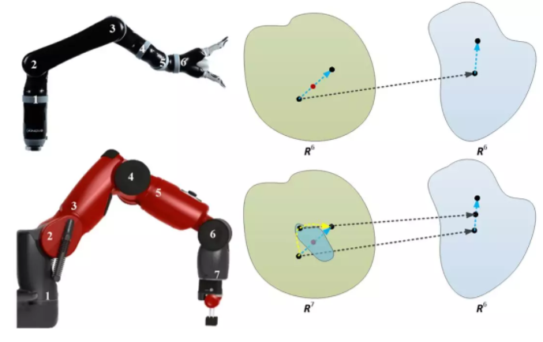
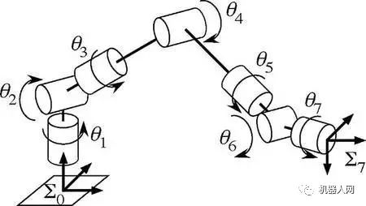

kyi-khyih-njin | kɿj kʰɿì ȵin

本笔记为机器人之基础，暂包括自动驾驶、机械臂（工业机器人）等主要子学科，若体量增大再分立

学习参考

- 教材
    - John J. Craig - Introduction to Robotics: Mechanics and Control
        - 主要讨论机械臂
- 攻略帖子
    - 此为渐近学习步骤包含理论与资料与经验 https://github.com/qqfly/how-to-learn-robotics
        - GitBook https://qiu6401.gitbook.io/how-to-learn-robotics
    - 此为机器人、自动驾驶乃至AI相关的很多话题的帖子汇总，它自己的笔记内容也很多 https://github.com/Ewenwan/MVision
        - 而且 Ewenwan 这个人竟然是同济的。。。
    - 《学习无人驾驶车，你所必须知道的。》 https://zhuanlan.zhihu.com/p/27686577
    - 此为自动驾驶相关，其个人经验与资料 https://github.com/ProgramTraveler/Road-To-Autonomous-Driving

# 机械臂

## 机械臂自由度数量及其理解

为何多为六自由度？直观理解，三维空间自由物体有6个自由度，而机械臂6个旋转自由度可经过变换解耦为末端工件的3个旋转、3个平移自由度。

- 线代：自由度 n = 6，是正定系统，常有唯一解；n > 6，即自由度冗余，是欠定系统，常有无穷解；n < 6，是超定系统，常无解
    - 雅可比矩阵将关节速度映射到末端执行器速度 $\dot{X} = J(θ)⋅\dot{θ}$

为何有七自由度之需求？

- 冗余自由度带来更多解，便于避开奇异点、避开障碍物（尤其人机协作而空间受限者）、姿态调整灵活（可在保持末端位置不变下调整姿态，在需要特定方向或角度操作时（如焊接、装配）有用），亦可进一步优化路径以节能等，亦可冗余容错（若有关节故障）

六自由度机械臂如下所示。典型者，谓肩、肘、腕各一垂直转一水平转也，其中肩先直后平，肘腕先平后直；或者说，肩前、肘腕间、腕末，这三个机构是垂直（z轴）旋转的。亦有让肘只保留水平转，而让腕兼有x、y、z三转。

[六轴机械臂一般指的是哪六个轴？](http://www.sdcq-micromotor.cn/service_details/27.html)

七自由度，往往是在肩肘之间也就是大臂上加一个z轴旋转机构。也好理解：这样就有3个转轴交于肩，3个交于腕，为计算带来好处。

