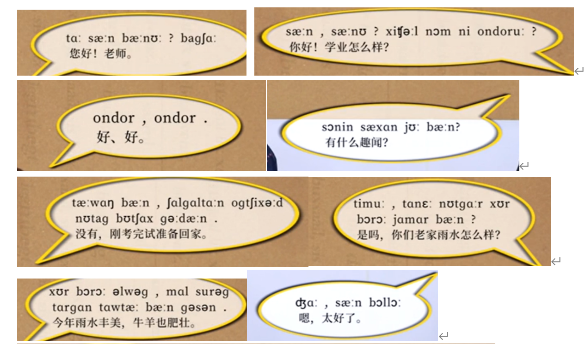
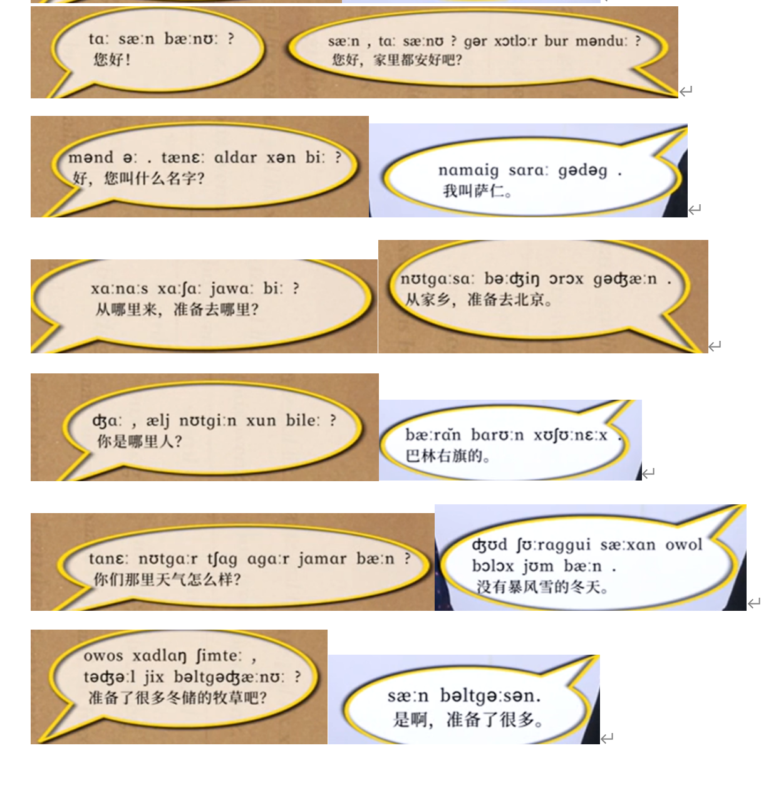
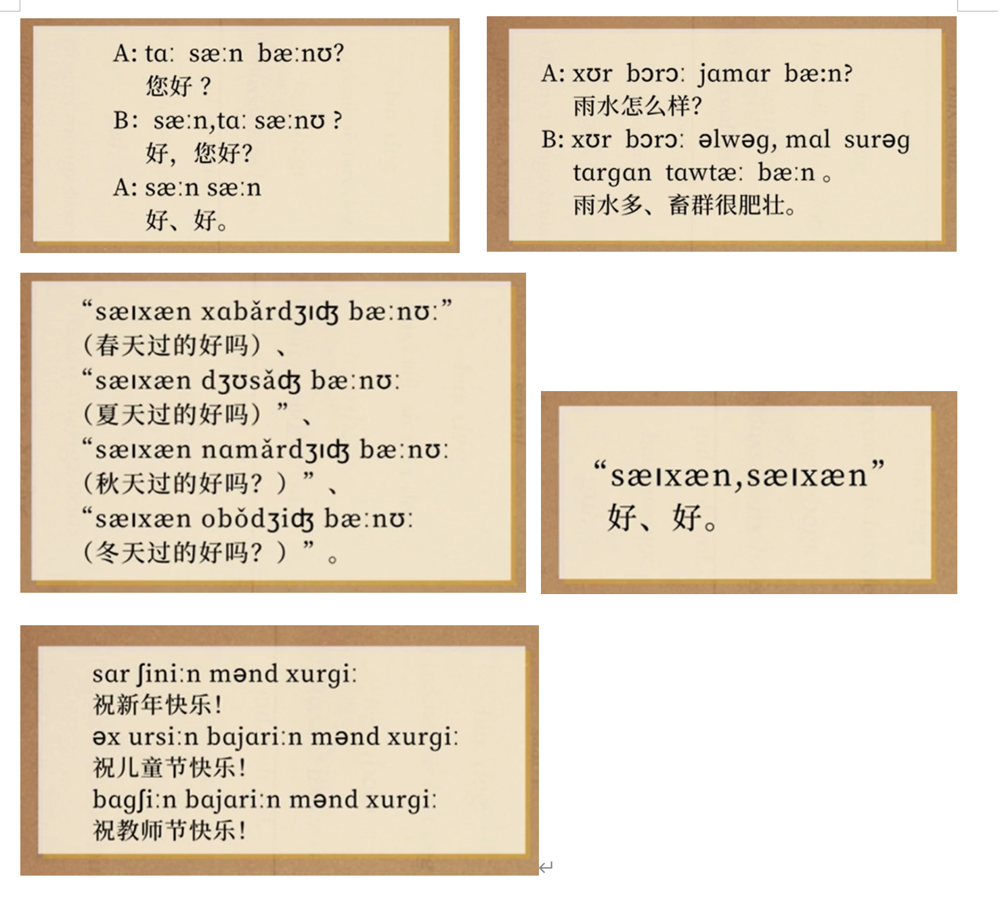

# 1 我国少数民族及其语言文字概况

## 1.1 我国少数民族概况

- 人口：1亿1379万2211人，总人口的8.49%
- 民族自治地方行政区面积占全国总面积64%
- 民族成分最多的省份是云南省，52个民族
- 壮族人口最多，回族分布最广
- 各民族分布特点：大散居、小聚居、交错杂居

## 1.2 我国少数民族语言文字概况

- 世界语言大概5600
- 中国境内已经识别和正在使用的语言涉及汉藏、阿尔泰、南岛、南亚、印欧等五大语系，分布这五个语系十余个语族的语言总计130多种，还有很多尚难界定语系、语族或语支以及混合语等的若干语种
- 少民语言
    - 主要使用地区：5个少民自治区，30个少民自治州，120个少民自治县，1000多个民族乡
    - 一个民族使用两种或多种语言的原因
        - 民族内部不同支系历史来源不同
        - 历史上一些民族支系，经过长期演变逐渐丧失除语言外的其他特点，融合于大民族
        - 以居住地区来称呼当地的少民语言
        - 由于征战、迁徙等历史原因，一个民族（或其中一部分）放弃了原来的民族语言，完全使用另一种新的语言
        - 同一民族，由于长期隔绝，彼此完全断绝来往，使用的语言朝不同方向发展，差别越来越大，形成不同语言
        - 还有一些民族成分未确定的待识别的民族共同体，人口一般比较少，分别使用一种或多种语言
        - 适用一种「混合语」
        - 有一些境外相邻民族，陆续迁徙来，仍保留与境外民族相同或相近的语言
    - 三十多个民族语属于跨境语言
    - 谱系分类
        - 汉藏语系
            - 藏缅语族：藏语、门巴语、景颇语、怒苏语、独龙语、彝语、哈尼语、纳西语、傈僳语、拉祜语、白语、基诺语、阿昌语、羌语、普米语、土家语、珞巴语等
            - 苗瑶语族：苗语、布努语、勉语、畲语等
            - 壮侗语族：壮语、布依语、傣语、侗语、仫（mu4）佬语、水语、毛南语、黎语、仡佬语等
        - 阿尔泰语系
            - 突厥语族：维吾尔语、哈萨克语、柯尔克孜语、乌兹别克语、塔塔尔语、撒拉语、西部裕固语
            - 蒙古语族：蒙古语、达斡尔语、土族语、东乡语、保安语、东部裕固语
            - 满通古斯语族：满语、锡伯语、鄂温克语、鄂伦春语、赫哲语
        - 南岛语系
            - 印度尼西亚语族：高山语
        - 南亚语系
            - 孟-高棉语族：佤语、布朗语、德昂语等
        - 印欧语系
            - 斯拉夫语族：俄罗斯语
            - 印度伊朗语族：塔吉克语
        - 未定系属关系的语言：朝鲜语、京语等
        - 还有一些混合语
- 少民文字
    - 概况：22个少数民族使用28种本民族文字
    - 分类
        - 音素文字
            - 以古印度字母为基础：藏文和四种傣文
            - 以回鹘字母为基础：蒙古文、满文、锡伯文
            - 以阿拉伯字母为基础：维吾尔文、哈萨克文、柯尔克孜文
            - 以拉丁字母为基础：壮文、布依文、侗文、四种苗文、两种傈僳文、纳西文、拉祜文、哈尼文、佤文、景颇文、载瓦文、土文
            - 独创字母类型：朝鲜文、滇东北老苗文
        - 音节文字：传统彝文、四川规范彝文

# 2 蒙古语

## 2.1 蒙古族及其语言文字

- 1 蒙古族分布概况
    - 国际：中国（630w）、蒙古国（300w）、俄罗斯（布里亚特（40w）、卡尔梅克（30w））、阿富汗（130w，哈扎拉）
    - 国内
- 2 蒙古语言文字基本情况
    - 蒙古语言：
        - 系属：阿尔泰语系，（突厥语族、满通古斯语族、蒙古语族）蒙古语族，同语族布里亚特语、卡尔梅克语、达斡尔语、莫戈勒语、东部裕固语、土族语、东乡语、保安语
        - 方言
            - 中部方言、东部方言、西部方言、北部方言
            - 国内：卫拉特方言（西部方言）、内蒙古方言（中部方言）、巴尔虎布里亚特方言（东北部方言）
        - 黏着语
    - 蒙古文字
        - 回鹘式蒙古文（13世纪）、巴思八文（1268）、阿里嘎里文字（1587）、托忒蒙古文（1648）、索永布文字（1686）、瓦金达拉文字（1905）、西里尔文（20世纪40年代）
        - 现行蒙古文
            - 传统蒙古文か胡都木文：回鹘式基础上发展来
            - 托忒蒙古文：比较准确表达卫拉特方言语音特征
            - 基里尔蒙古文か新蒙古文

## 2.2 蒙古语的元音辅音

- 以蒙古语标准音（察哈尔土语语音为主）为例
- 元音：短、长、复
    - ɑ、ə、i、ɪ、ɔ、ʊ、o、u
    - ɑː、əː、iː、ɪː、ɔː、ʊː、oː、uː、eː
    - ɑi、ɔi、ʊi、ui、ʊɑ、ʊɑi
- 辅音
    - bpwmdtslrmd͡ʒt͡ʃʃjgxŋ
    - 外来：f、dz、ts、ɬ、d、ɖʐ、ʈ͡ʂ、ʂ
- 字母在词中、根据字母在音节中、音节在词中不同位置有不同写法

IPA|拉|新|起中尾|独
-|-|-|-|-
ɑ | a | а | ᠠᠠᠠ |ᠠ
ə | e | э | ᠡᠡᠡ |ᠡ
/i/ or /ɪ/|i|и|ᠢᠢᠢ|ᠢ
ɔ|o|о|ᠣᠣᠣ|ᠣ
ʊ|u|у|ᠤᠤᠤ|ᠤ
o|ö|ө|ᠥᠥᠥ|ᠥ
u|ü|ү|ᠦᠦᠦ|ᠦ
e in loanwords|ē|е|ᠧᠧᠧ|ᠧ
n|n|н|ᠨ‍ᠨ‍ᠨ
ŋ|ng|нг|‍-ᠩ‍‍ᠩ
b|b|б| ᠪ‍ᠪ‍ᠪ
p|p|п| ᠫ‍ᠫ‍ᠫ
x|q/k|х|‍ ᠬ‍‍ᠬ‍‍ᠬ
ɣ|γ|г| ᠭ ᠭᠭᠭ
g|g|г|‍ᠭ᠍‍‍ᠭ᠍‍‍ᠭ᠋
m|m|м| ᠮ‍ᠮ‍ᠮ
l|l|л|‍ ‍ᠯᠯ‍‍‍‍‍ᠯ
/s/, or /ʃ/ before i|s|с| ᠰ‍ᠰ‍ᠰ
/ʃ/|š|ш| ᠱ‍ᠱ‍ᠱ
t|t|т|ᠲ‍ᠲ‍-
d|d|д|ᠳ‍ᠳ‍ᠳ
/t͡ʃ/|č|ч|ᠴ‍ᠴ‍ᠴ
/d͡ʒ/|ǰ|ж|ᠵ‍ᠵ‍ᠵ
j|y|й|ᠶ‍ᠶ‍-
r|r|р|ᠷ‍ᠷ‍ᠷ
w|w|в|‍ᠸ‍‍ᠸ‍‍ᠸ
f|f|ф|ᠹ‍ᠹ‍ᠹ
k|g|к|ᠺ‍ᠺ‍ᠺ
kʰ（转藏梵）|k|к|ᠻ‍ᠻ‍ᠻ
/t͡s/|c|ц|ᠼ‍ᠼ‍ᠼ
/d͡z/|z|з|ᠽ‍ᠽ‍ᠽ
h|h|х|ᠾ‍ᠾ‍ᠾ
/ʐ/|ž|ж|ᠿ‍--
ལྷ /lha/|lh|лх|ᡀ‍ᡀ‍-
拼音zh|zh|з|ᡁ‍--
拼音ch|ch|ч|ᡂ‍--

## 2.3 蒙古语基础词汇

- 1 亲属称谓
- 2 四季与牧业生产
- 3 疑问词

意义|音（课）|蒙/新蒙（谷歌）
-|-|-
爷爷|oboː|өвөө
奶奶|əməː|эмээ
爸爸|ɑːb|аав
妈妈|əːdʒ|ээж
额吉淖尔盐湖（母亲湖）|
哥哥|ɑx|ах
伙头|
姐姐|əgtʃ|эгч
弟弟妹妹|duː|дүү
叔叔伯伯|ɑbăg|авга
舅舅|nɑgătʃ
春|xɑbăr|хавар
夏|dʒʊn|зун
秋|nɑmăr|намар
冬|obŏl|өвөл
降雨|xʊr bɔrɔːn
家乡|nʊtăg
天气|tʃɑg ɑːr
谁|xən|хэн
什么|juː
几个|xəd|хэд
什么样|jamăr
何时|xədʒəː
何地|xɑː

## 2.4 蒙古语情景对话

> tɑː sæːn bæːnʊː ? bagʃɑː （您好！老师。）
> sæːn , sæːnʊ ? xitʃǝːl nɔm ni ondoruː ? （您好！学业怎么样？）
> ondor , ondor . （好，好。）
> sɔnin sæxɑn jʊː bæːn ? （有什么趣闻？）
> tæːwɑŋ bæːn , ʃɑlgɑltɑːn ogtʃixǝːd nʊtag bʊtʃɑx gǝːdæːn .（没有，刚考完试准备回家）
> timuː , tɑnɛː nʊtgɑːr xʊr bɔrɔː jɑmɑr bæːn ?（是吗，你们老家雨水怎么样？） 
> 后面的不想敲了

